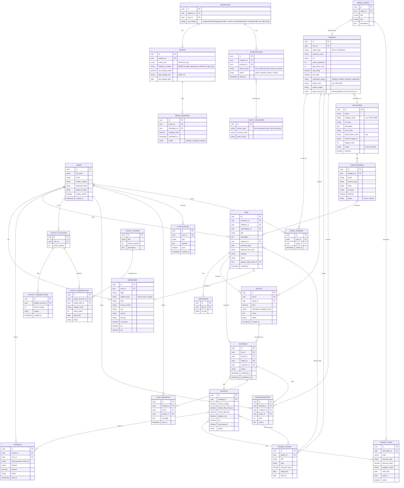
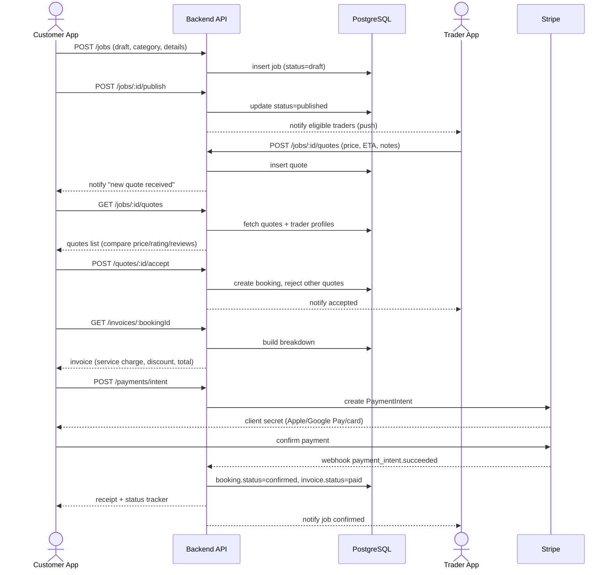
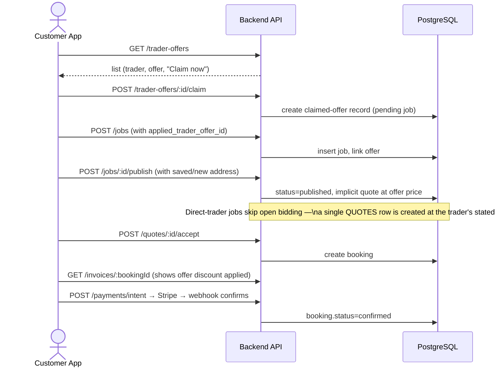
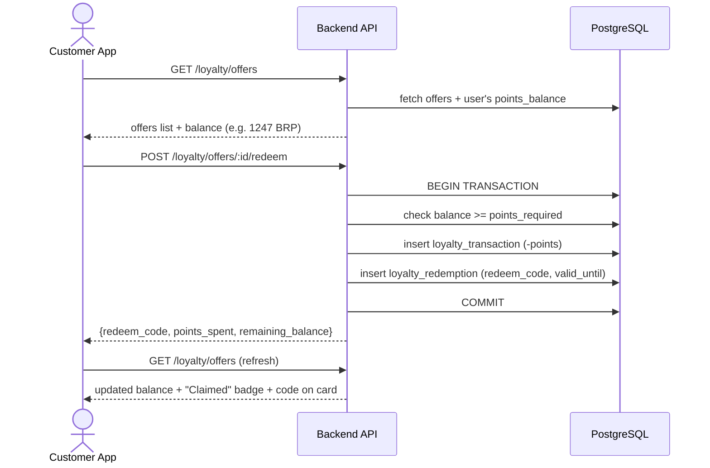
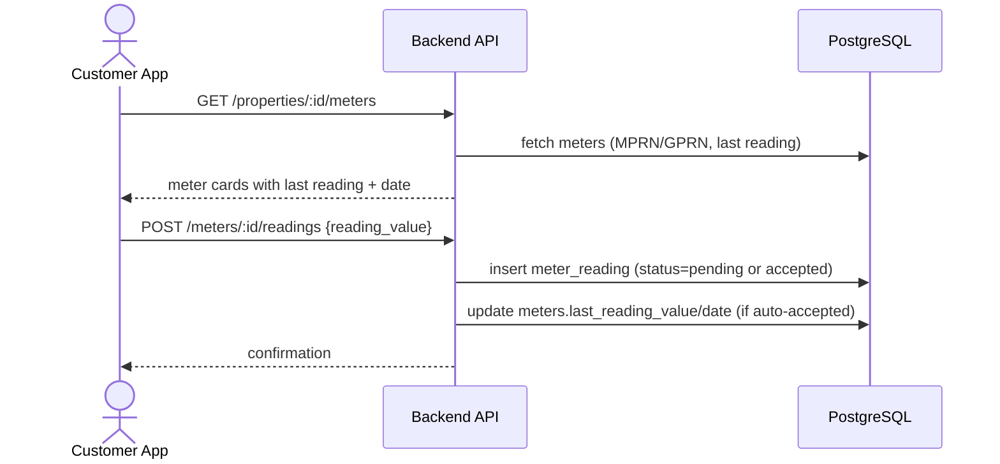
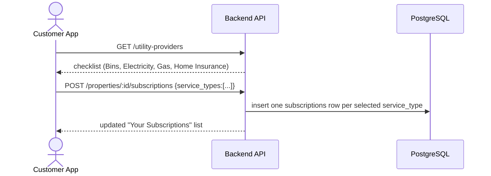
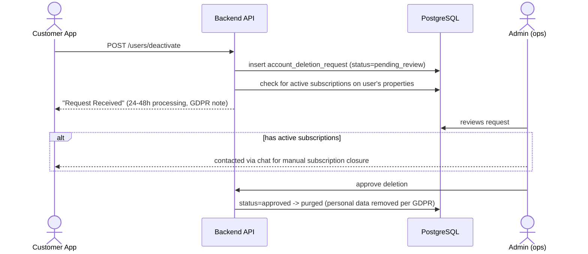
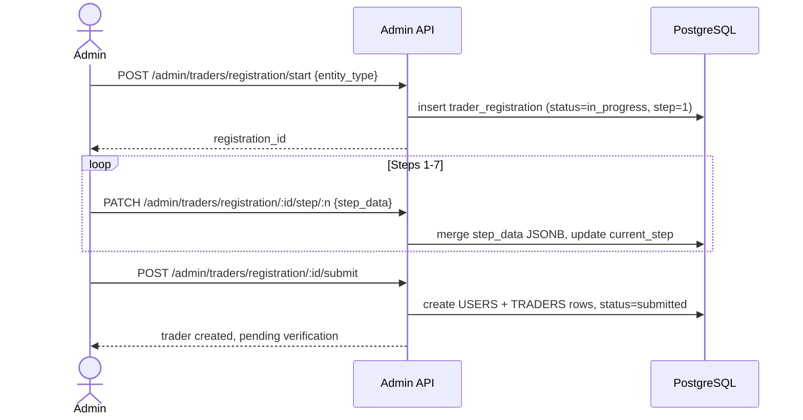
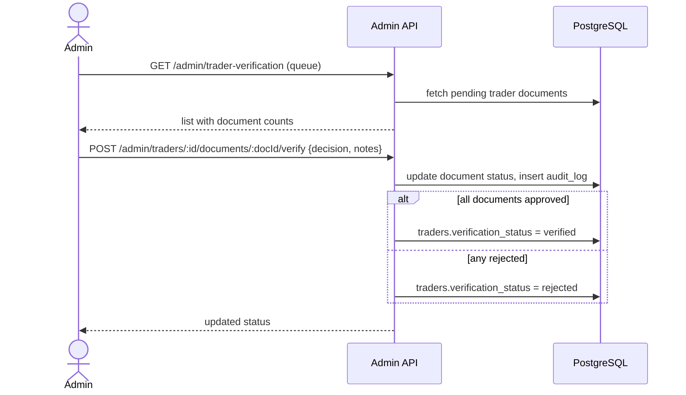
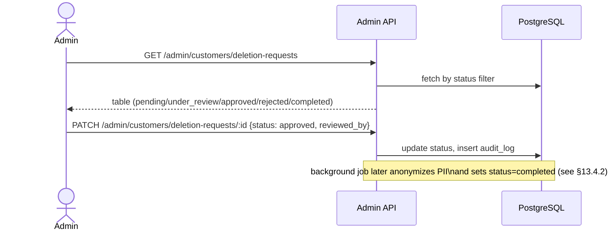

# BRISK Platform — Backend Architecture & Build Plan (v1)

> **Purpose of this document:** This is the master planning file to hand to Cursor so we can build the BRISK Node.js backend step-by-step. It consolidates everything from the process docs (Consumer App Journey, Direct Traders Offer Flow, Quote-wise Offer Flow, Brisk Offer Flow, Loyalty Flow) and the Microservices vs Monolith decision doc.
>
> **Status: WORK IN PROGRESS.** This is not the final/complete requirement set. Several flows (Trader App side, admin panel, disputes, refunds edge-cases, exact commission model, KYC/verification of traders, subscription "Premium Utility Pack", exact push/SMS providers, utility-provider integrations) are still under discussion and will be added incrementally. Treat every section below as "current best understanding" — we will revise this file as decisions are confirmed, not throw it away and start over.
>
> Build approach: **step by step, module by module**, starting with backend core (auth → users/traders → categories → jobs → quotes/offers → payments → loyalty → chat/notifications), each shipped and tested before moving to the next.
>
> **v2 update:** Actual Figma screenshots of the Customer App (Onboarding, My Property, My Address, Profile, Notifications, Offers, Post-a-Job) have now been reviewed directly (not just the process docs). This revealed a **module the process docs never mentioned at all**: **Property & Utilities Management** — a "My Property" tab where customers submit electricity/gas meter readings (MPRN/GPRN) and manage utility subscriptions (Bins, Electricity, Gas, Home Insurance). This is added as new §4A (property model), §5 (folder structure), and §6.2A (module logic) below. The architecture decision (modular monolith, no microservices) is unchanged and reconfirmed.
>
> **v3 update:** 19 screenshots of the live **BRISK Admin Panel** (brisk-admin.netlify.app) have now been reviewed screen-by-screen — every button, form field, table column, and filter. Full Admin Panel requirements, data model extensions, and APIs are now documented in **§14**. This also **resolved a previously open item — the platform fee is confirmed at 10%** (see §9 and §13.9). No microservices were introduced — the Admin Panel is served by the same monolith, just a different set of routes/controllers guarded by admin roles.

---

## 0. Source Material Used to Build This Plan

| Document | What it gave us |
|---|---|
| `BRISK_Consumer_App_User_Journey_&_Functional_Flow_Document.docx` | End-to-end customer journey: onboarding, job posting, quotes, payment, job execution, reschedule, cancellation, booking/payment history |
| `BRISK_Direct_Traders_Offer_Flow.docx` | Screen-by-screen flow where customer picks a **specific trader's offer first**, then posts a job against it |
| `BRISK_Quote_wise_Offer_Flow.docx` | Screen-by-screen flow where customer **posts a job publicly**, receives multiple quotes, compares, chats, accepts one |
| `BRISK_Offer_Flow.docx` | "Brisk Offers" (platform-curated offers from traders) + promo code redemption during checkout |
| `BRISK_Loyalty_Process_Documentation_EN.docx` | BRISK Points (BRP) balance, claiming loyalty offers, redemption codes |
| `BRISK_Microservices_vs_Monolith_Simple_Comparison.pdf` | Architecture decision input — see §1 |
| `BRISK_Logo.pdf` | Brand only (BRISK — "Making Things Quicker") — no functional content |
| **19 Figma screenshots (Customer App UI)** — Onboarding/Welcome, Login, Face ID biometric login, Create Account, My Property (meter readings), My Address (address book + Add Address modal), My Profile, Edit Profile, Account deactivation flow, Notifications, Traders Offers + Filters modal, Post a New Job Step 1, Brisk Offers | **New, higher-fidelity source** — confirms/extends the docx flows and reveals the Property & Utilities module (§4A/§6.2A) that no process doc mentioned. Customer app only — trader app screenshots not yet provided. |
| Figma proto links (Customer App UI, Trader UI App) | Still **could not be auto-fetched** — Figma proto links require an authenticated session and are blocked for automated tools. The 19 screenshots above cover a meaningful chunk of the Customer app directly; the Trader UI App proto link is still unreviewed. See §12. |
| **19 screenshots — BRISK Admin Panel** (`brisk-admin.netlify.app`, live build, not Figma) | **New, highest-fidelity source yet** — a working admin web app, not a mockup. Covers: Admin Dashboard, System Users (RBAC), Customers directory, Account Deletion Requests, Customer Payment & Billing, Traders Management, Trader Registration wizard (8 steps), Trader Verification/Audit portal, Jobs & Services, Offer Management (+ Create Offer form), Category Master, Sub-Category Master, and Reports & Analytics (Dashboard, Customers, Traders tabs). Full breakdown in **§14**. This confirms real field names, real status enums, and the **platform fee (10%)** that was previously an open item. |

---

## 1. Architecture Decision: Modular Monolith First

Per the internal comparison doc, at BRISK's current stage (startup, small-to-medium team, Node.js + PostgreSQL) a **well-structured modular monolith on Express.js** is the right call, not microservices yet:

- A single, well-built monolith comfortably handles **2,000–20,000 concurrent users** on 1–4 mid-size servers (Stack Overflow runs its entire Q&A platform on 9 servers this way).
- Estimated cost at BRISK's scale: **~$90–1,000/month** vs **$500–5,000+/month** for microservices.
- Faster to build, one deployable unit, one codebase, easier for a small team to reason about and secure.
- Microservices only start to win once BRISK needs millions of users or very uneven load per feature (that's a "later" problem, not a "day 1" problem).

**Decision:** Build a **modular monolith** — one Express.js app, cleanly separated into self-contained **feature modules** (each with its own routes/controller/service/model), sharing one PostgreSQL database. This is structured so that if/when a specific module (e.g. Payments, or Notifications) needs to be pulled out into its own service later, the boundaries already exist and it's an extraction, not a rewrite.

> **Reconfirmed:** No microservices anywhere in this plan — this applies to every module added below, including the new Property & Utilities module. It lives inside the same monolith as `src/modules/property/`, same as every other module.

---

## 2. Recommended Tech Stack

| Layer | Choice | Notes |
|---|---|---|
| Runtime | Node.js (LTS) + TypeScript | TypeScript strongly recommended for a team building with Cursor — catches shape mismatches across modules early |
| Web framework | Express.js | Per architecture decision |
| Database | PostgreSQL (AWS RDS) | Relational — job/quote/payment/loyalty data is highly relational |
| ORM | Prisma (or Sequelize) | Prisma recommended for TS-native migrations + type safety |
| Auth | JWT (access + refresh tokens) + OTP for mobile verification + device biometric unlock | Screens show an **in-app "Face ID" screen** (separate from OS-level Apple Sign-In) with "Biometric system active" / "Sign in with Face ID" / "Use Password Instead". Backend implication: this is the standard **local biometric unlocks a device-stored refresh token** pattern — the phone's Face ID/fingerprint API never sends biometric data to BRISK; the app unlocks its secure-storage refresh token locally, then calls the normal `POST /auth/refresh`. No new biometric data touches the backend. If true Apple Sign-In (Face ID as OS login) is also wanted separately, that stays a distinct `POST /auth/apple-signin` path — to confirm which one(s) BRISK wants. |
| File/image storage | AWS S3 | Job photos, trader profile photos, ID/KYC docs, receipts |
| CDN | AWS CloudFront in front of S3 | Serve images fast to mobile apps |
| Realtime (chat, live quote updates, notifications) | Socket.IO (or AWS API Gateway WebSockets later) | Chat with Trader, live "new quote received" updates |
| Push notifications | Firebase Cloud Messaging (Android) + APNs (iOS) via a unified service | Job status changes, new quote, chat message, offer claimed |
| SMS/OTP | AWS SNS or Twilio | OTP verification on registration |
| Transactional email | AWS SES | Receipts, password reset, confirmations |
| Payments | Stripe (confirmed by docs — "powered by Stripe") | Apple Pay / Google Pay via Stripe's payment element; card payments direct |
| Background jobs / queues | AWS SQS + a worker process (BullMQ optional if Redis is introduced) | Payment webhooks, notification fan-out, reminder emails |
| Caching / rate limiting | Redis (AWS ElastiCache) — optional for v1, needed once traffic grows | Session/rate-limit store, category list caching |
| Hosting | AWS ECS Fargate (containerized Express app) or Elastic Beanstalk for v1 simplicity | Start simple (Beanstalk / single ECS service), containerize from day 1 so moving to Fargate/EKS later is trivial |
| Infra as code | Terraform or AWS CDK | Recommended once infra stabilizes, not required for local dev |
| API docs | OpenAPI/Swagger (`swagger-jsdoc` + `swagger-ui-express`) | So the Customer app / Trader app / Cursor all work off one contract |
| Logging/monitoring | CloudWatch Logs + a structured logger (pino/winston) | |
| Validation | Zod (pairs well with TypeScript) | Request-level validation per module |

---

## 2A. Confirmed App Information Architecture (from screenshots)

Bottom navigation on the Customer App is confirmed across multiple screens as **5 tabs**:

```
Jobs   |   Property   |   Offers   |   Messages   |   Profile
```

- **Jobs** — active/completed/cancelled job list (matches Consumer Journey §8 Booking History), this is the app's home/default tab.
- **Property** — **new module**, two sub-tabs: **My Property** (meter readings + subscriptions) and **My Address** (saved address book). See §4A/§6.2A.
- **Offers** — two sub-tabs: **Traders Offers** and **Brisk Offers** (matches the two offer-flow docs), each with its own filter modal.
- **Messages** — chat threads (matches §6.10 Chat module).
- **Profile** — account, bookings, addresses, preferences, log out (matches §6.2 Users module, extended below).

A bell icon (top right, with unread dot) opens the **Notifications** screen from any tab.

---

## 3. High-Level System Architecture

```mermaid
flowchart TB
    subgraph Clients
        CA[Customer App - iOS/Android]
        TA[Trader App - iOS/Android]
    end

    subgraph AWS
        CF[CloudFront CDN]
        ALB[Load Balancer]
        subgraph ECS["ECS Fargate / Beanstalk"]
            APP[Express.js Monolith\n(Modular: Auth, Users, Traders, Property/Utilities,\nJobs, Quotes, Offers, Payments,\nLoyalty, Chat, Notifications)]
        end
        WS[Socket.IO Realtime Layer]
        RDS[(PostgreSQL - RDS)]
        S3[(S3 - Images/Docs/Receipts)]
        SQS[[SQS Queues]]
        WORKER[Background Worker\n(notifications, webhooks, reminders)]
        SES[SES - Email]
        SNS[SNS - OTP/SMS]
        SECRETS[Secrets Manager]
    end

    subgraph ThirdParty
        STRIPE[Stripe - Payments/Apple Pay/Google Pay]
        FCM[FCM/APNs - Push]
        MAPS[Maps/Places API - Location search]
    end

    CA -->|HTTPS| ALB
    TA -->|HTTPS| ALB
    CA -.->|WebSocket| WS
    TA -.->|WebSocket| WS
    ALB --> APP
    WS --> APP
    APP --> RDS
    APP --> S3
    CF --> S3
    APP --> SQS
    SQS --> WORKER
    WORKER --> SES
    WORKER --> FCM
    APP --> SNS
    APP --> STRIPE
    APP --> MAPS
    APP --> SECRETS
```

---

## 4. Core Domain / ER Diagram

This covers the entities identified across all five process docs, plus the Property & Utilities entities confirmed from the Figma screenshots (§4A).



> Note: `INVOICES` deliberately carries **both** `trader_offer_discount` and `promo_discount` as separate columns because the docs show these as two distinct discount sources that can appear on the same invoice (Direct Trader Offer discount vs a Brisk promo code applied at checkout).

---

## 4A. New Module: Property & Utilities Management

This is not in any of the five process docs — it surfaced only from the Figma screenshots ("My Property" and "My Address" tabs under the new **Property** bottom-nav item). Documenting it fully here since it's a real, screen-complete feature:

**My Property tab:**
- An address selector at the top (`Select Address` dropdown) — a property is really just "an address the customer manages utilities for," 1:1 with an `ADDRESSES` row (see `PROPERTIES` entity, which extends an address rather than duplicating it).
- **Electricity meter card**: shows MPRN (Meter Point Reference Number, an 11-digit code unique to the property, per the in-app tooltip), last reading value + unit (kWh) + date, and an input to submit a new reading.
- **Gas meter card**: same pattern with GPRN (Gas Point Registration Number, 7–8 digit code per tooltip), unit m³.
- **Your Subscriptions** list: shows which utility/service providers are currently linked to this property — seen examples: Bins (Dublin City Council), Electricity (Electric Ireland), Gas (Bord Gáis Energy). Each row is tappable (chevron) for more detail.
- **Add Subscription** (bottom button, opens modal): checklist of available services — Bins, Electricity, GAS, Home Insurance — each with a provider name shown under it; user ticks the ones they want BRISK to manage and taps **Save Subscription**. Copy explicitly states "You can manage these at any time in your profile."

**My Address tab:**
- List of saved addresses (Home marked `Primary` badge, Work, etc.), each with edit/delete icons.
- **Add Address modal**: type toggle (Home / Work / Custom), a map picker (pin drop), then form fields: Street Address, House/Apartment No, **MPRN Number**, **GPRN Number**, **UTN Number** (meaning not yet confirmed — see Open Items), City, County, Eircode.
- This confirms `ADDRESSES` needs the extended field set now reflected in §4's ER diagram (`address_type`, `house_number`, `county`, `eircode`, `is_primary`), and that MPRN/GPRN can be captured **either** at address-creation time **or** later against a specific meter — the backend should treat "meter reference number" as upsertable independently of the address form (a customer might add the address first and the MPRN later once they find their bill).

**Backend implication — read carefully:** BRISK does **not** appear to be reading meters or utility accounts live from Electric Ireland / Bord Gáis / Dublin City Council via API integration (nothing in the screens suggests OAuth/account-linking with those providers). The most defensible v1 interpretation is: **customers self-report meter readings** (BRISK stores them, perhaps for record-keeping or to attach to a job like "submit a reading before a boiler service") and **subscriptions are just a saved list of which providers apply to this property** (metadata, not a live account link). This needs explicit confirmation — see §11 Open Items — before building any provider-integration work.

---

## 5. Backend Project Folder Structure

Feature-module (a.k.a. "vertical slice") structure — each module owns its routes, controller, service, validation, and (if module-specific) model file. Shared/global model definitions live in `database/models`.

```
brisk-backend/
├── src/
│   ├── config/
│   │   ├── env.ts                  # loads & validates env vars
│   │   ├── database.ts             # Prisma/Sequelize client init
│   │   ├── aws.ts                  # S3, SES, SNS, SQS clients
│   │   ├── stripe.ts               # Stripe client init
│   │   └── swagger.ts              # OpenAPI setup
│   │
│   ├── modules/
│   │   ├── auth/
│   │   │   ├── auth.routes.ts
│   │   │   ├── auth.controller.ts
│   │   │   ├── auth.service.ts       # register, login, refresh, apple sign-in
│   │   │   ├── otp.service.ts        # generate/verify OTP via SNS/Twilio
│   │   │   ├── auth.validation.ts    # zod schemas
│   │   │   └── auth.types.ts
│   │   │
│   │   ├── users/
│   │   │   ├── users.routes.ts
│   │   │   ├── users.controller.ts
│   │   │   ├── users.service.ts      # profile CRUD, stats (jobs posted, avg rating, saved traders)
│   │   │   ├── account-deletion.service.ts # deactivation request, GDPR purge workflow
│   │   │   └── users.validation.ts
│   │   │
│   │   ├── traders/
│   │   │   ├── traders.routes.ts
│   │   │   ├── traders.controller.ts
│   │   │   ├── traders.service.ts    # profile, stats, verification status
│   │   │   └── traders.validation.ts
│   │   │
│   │   ├── property/
│   │   │   ├── addresses/
│   │   │   │   ├── addresses.routes.ts
│   │   │   │   ├── addresses.controller.ts
│   │   │   │   └── addresses.service.ts    # My Address tab: CRUD, primary flag, geocoding
│   │   │   ├── meters/
│   │   │   │   ├── meters.routes.ts
│   │   │   │   ├── meters.controller.ts
│   │   │   │   └── meters.service.ts       # MPRN/GPRN registration, reading submission/history
│   │   │   └── subscriptions/
│   │   │       ├── subscriptions.routes.ts
│   │   │       ├── subscriptions.controller.ts
│   │   │       └── subscriptions.service.ts # link/unlink utility providers per property
│   │   │
│   │   ├── categories/
│   │   │   ├── categories.routes.ts
│   │   │   ├── categories.controller.ts
│   │   │   └── categories.service.ts # category/subcategory tree, Residential/Commercial filter
│   │   │
│   │   ├── jobs/
│   │   │   ├── jobs.routes.ts
│   │   │   ├── jobs.controller.ts
│   │   │   ├── jobs.service.ts       # create/publish/reschedule/cancel job
│   │   │   ├── jobs.validation.ts
│   │   │   └── job-images.service.ts # S3 upload for job photos
│   │   │
│   │   ├── quotes/
│   │   │   ├── quotes.routes.ts
│   │   │   ├── quotes.controller.ts
│   │   │   └── quotes.service.ts     # trader submits quote, customer compares/accepts
│   │   │
│   │   ├── offers/
│   │   │   ├── trader-offers/
│   │   │   │   ├── trader-offers.routes.ts
│   │   │   │   ├── trader-offers.controller.ts
│   │   │   │   └── trader-offers.service.ts   # "Claim now" direct-trader offers
│   │   │   ├── brisk-offers/
│   │   │   │   ├── brisk-offers.routes.ts
│   │   │   │   ├── brisk-offers.controller.ts
│   │   │   │   └── brisk-offers.service.ts    # curated offers list + tags
│   │   │   └── promo-codes/
│   │   │       ├── promo-codes.routes.ts
│   │   │       ├── promo-codes.controller.ts
│   │   │       └── promo-codes.service.ts     # validate/apply code to invoice
│   │   │
│   │   ├── bookings/
│   │   │   ├── bookings.routes.ts
│   │   │   ├── bookings.controller.ts
│   │   │   └── bookings.service.ts   # booking status machine, history, details
│   │   │
│   │   ├── invoices/
│   │   │   ├── invoices.routes.ts
│   │   │   ├── invoices.controller.ts
│   │   │   └── invoices.service.ts   # builds breakdown (service charge, discounts, fees, tax)
│   │   │
│   │   ├── payments/
│   │   │   ├── payments.routes.ts
│   │   │   ├── payments.controller.ts
│   │   │   ├── payments.service.ts   # Stripe PaymentIntents, Apple/Google Pay
│   │   │   ├── payments.webhook.ts   # Stripe webhook handler
│   │   │   └── billing.validation.ts # individual vs company billing
│   │   │
│   │   ├── loyalty/
│   │   │   ├── loyalty.routes.ts
│   │   │   ├── loyalty.controller.ts
│   │   │   └── loyalty.service.ts    # points balance, claim/redeem, redeem codes
│   │   │
│   │   ├── ratings/
│   │   │   ├── ratings.routes.ts
│   │   │   ├── ratings.controller.ts
│   │   │   └── ratings.service.ts
│   │   │
│   │   ├── chat/
│   │   │   ├── chat.routes.ts
│   │   │   ├── chat.controller.ts
│   │   │   ├── chat.service.ts
│   │   │   └── chat.gateway.ts       # Socket.IO namespace/events
│   │   │
│   │   ├── notifications/
│   │   │   ├── notifications.routes.ts
│   │   │   ├── notifications.controller.ts
│   │   │   ├── notifications.service.ts
│   │   │   └── push.service.ts       # FCM/APNs dispatch
│   │   │
│   │   ├── uploads/
│   │   │   ├── uploads.routes.ts
│   │   │   ├── uploads.controller.ts
│   │   │   └── s3.service.ts         # pre-signed URLs
│   │   │
│   │   └── admin/                    # Admin Panel backend — see §14 for full spec
│   │       ├── admin-auth/
│   │       │   ├── admin-auth.routes.ts
│   │       │   ├── admin-auth.controller.ts
│   │       │   └── admin-auth.service.ts      # separate admin login, RBAC roles (Admin/Super Admin)
│   │       ├── admin-users/
│   │       │   ├── admin-users.routes.ts
│   │       │   ├── admin-users.controller.ts
│   │       │   └── admin-users.service.ts     # System Users screen: CRUD, roles, status
│   │       ├── admin-dashboard/
│   │       │   ├── admin-dashboard.routes.ts
│   │       │   ├── admin-dashboard.controller.ts
│   │       │   └── admin-dashboard.service.ts # overview stats, activity trend, audit log feed, shortcuts
│   │       ├── admin-customers/
│   │       │   ├── admin-customers.routes.ts
│   │       │   ├── admin-customers.controller.ts
│   │       │   └── admin-customers.service.ts # directory, deletion requests queue, payment/billing views
│   │       ├── admin-traders/
│   │       │   ├── admin-traders.routes.ts
│   │       │   ├── admin-traders.controller.ts
│   │       │   ├── admin-traders.service.ts       # directory, CRUD
│   │       │   ├── trader-registration.service.ts # 8-step onboarding wizard, resumable
│   │       │   └── trader-verification.service.ts # document audit/approve/reject queue
│   │       ├── admin-jobs/
│   │       │   ├── admin-jobs.routes.ts
│   │       │   ├── admin-jobs.controller.ts
│   │       │   └── admin-jobs.service.ts      # cross-customer/trader job oversight, status tabs
│   │       ├── admin-offers/
│   │       │   ├── admin-offers.routes.ts
│   │       │   ├── admin-offers.controller.ts
│   │       │   └── admin-offers.service.ts    # unified OFFERS CRUD (platform + trader), analytics
│   │       ├── admin-categories/
│   │       │   ├── admin-categories.routes.ts
│   │       │   ├── admin-categories.controller.ts
│   │       │   └── admin-categories.service.ts # category/sub-category master CRUD
│   │       ├── admin-transactions/
│   │       │   ├── admin-transactions.routes.ts
│   │       │   ├── admin-transactions.controller.ts
│   │       │   └── admin-transactions.service.ts
│   │       ├── admin-payouts/
│   │       │   ├── admin-payouts.routes.ts
│   │       │   ├── admin-payouts.controller.ts
│   │       │   └── admin-payouts.service.ts   # trader payout ledger, manual payout actions
│   │       ├── admin-reports/
│   │       │   ├── admin-reports.routes.ts
│   │       │   ├── admin-reports.controller.ts
│   │       │   └── admin-reports.service.ts   # read-only aggregation per report tab, CSV export
│   │       ├── admin-audit/
│   │       │   ├── admin-audit.routes.ts
│   │       │   └── admin-audit.service.ts     # writes to AUDIT_LOGS, feeds Recent Audit Log widget
│   │       └── admin-cms/                     # System & Governance — scope still thin, see §13.12
│   │           ├── admin-cms.routes.ts
│   │           └── admin-cms.controller.ts
│   │
│   ├── database/
│   │   ├── schema.prisma             # (if Prisma) full schema from §4
│   │   ├── migrations/
│   │   └── seeders/
│   │       ├── categories.seed.ts
│   │       └── demo-data.seed.ts
│   │
│   ├── middlewares/
│   │   ├── auth.middleware.ts        # verify JWT, attach req.user
│   │   ├── role.middleware.ts        # customer vs trader vs admin guard
│   │   ├── error.middleware.ts       # centralized error handler
│   │   ├── rateLimiter.middleware.ts
│   │   └── validate.middleware.ts    # zod schema wrapper
│   │
│   ├── jobs-queue/                   # background workers (naming avoids clash with "jobs" domain module)
│   │   ├── notification.worker.ts
│   │   ├── payment-webhook.worker.ts
│   │   └── reminder.worker.ts        # reschedule/cancellation reminders
│   │
│   ├── sockets/
│   │   └── socket-server.ts          # Socket.IO bootstrap, auth handshake
│   │
│   ├── utils/
│   │   ├── logger.ts
│   │   ├── apiResponse.ts
│   │   ├── errors.ts
│   │   └── pagination.ts
│   │
│   ├── app.ts                        # express app, middleware wiring, route mounting
│   └── server.ts                     # http server bootstrap, graceful shutdown
│
├── tests/
│   ├── unit/
│   └── integration/
│
├── docker-compose.yml                # local Postgres + app for dev
├── Dockerfile
├── .env.example
├── package.json
└── tsconfig.json
```

---

## 6. Module-by-Module Logic (mapped to the process docs)

### 6.1 Auth Module
- `POST /auth/register` — full name (profile photo optional — **deferred**, no S3 upload in v1 yet), email, phone number (with country dial code, e.g. `+353`), password, `role` (`CUSTOMER` | `TRADER`), `acceptedTerms: true` → creates unverified user, triggers OTP. Password rules confirmed on-screen: **min 8 characters, one uppercase letter, one number/special character** — enforce server-side in `auth.validation.ts`. Terms & Privacy checkbox required (`acceptedTerms` must be `true`).
- `POST /auth/verify-otp` — verifies OTP, activates account. Payload: `{ mobileNumber, code }` (6-digit code).
- `POST /auth/resend-otp` — resends OTP to an **unverified** mobile number. Payload: `{ mobileNumber }`. **60-second cooldown** between sends (returns `429` if called too soon). OTP expires after **10 minutes**. Mock SMS OTP `123456` enabled for dev/staging until SNS/Twilio is configured.
- `POST /auth/login` — email + password → JWT access + refresh token. If mobile is unverified, returns `401` and auto-sends OTP (respecting the same 60s cooldown).
- `GET /auth/me` — returns authenticated Customer/Trader profile (requires Bearer access token).
- **Biometric ("Face ID") login** — local biometric unlocks a device-stored refresh token; app calls `POST /auth/refresh`. **No biometric data sent to backend.**
- `POST /auth/refresh` — issue new access token from refresh token. Payload: `{ refreshToken }`.
- `POST /auth/logout` — invalidate client session (stateless JWT — client discards tokens; requires Bearer access token).
- `POST /auth/apple-signin` — **DEFERRED** (open item §11 — confirm with client before integrating Apple identity token).
- **Image/profile photo upload** — **DEFERRED** (S3 pre-signed URLs not built yet; `profilePhotoUrl` can be set later via Users module once uploads module exists — see §6.13).
- Same module serves both Customer app and Trader app; `role` on the user record plus a `traders` profile record auto-created when role = `TRADER` and OTP is verified.

### 6.2 Users & Traders Modules
- Users: profile CRUD (Display Name, Email — shown **read-only/locked** with a padlock icon once set, Phone with country code), preferences (Notifications on/off toggle).
- Profile screen shows three **derived stats**: Jobs Posted, Avg Rating (as a customer, if BRISK collects ratings both ways — to confirm), Saved Traders (count from the new `SAVED_TRADERS` table — a "favorite trader" feature not previously documented; needs a `POST /traders/:id/save` / `DELETE /traders/:id/save` pair).
- **Account deactivation** (confirmed via 3-dot menu → "Deactivate Account"): `POST /users/deactivate` creates a deletion request in `pending_review` status, does **not** delete data immediately. Response screen explicitly states: processing window **24–48 hours**, data is "permanently purged following GDPR compliance protocols" once approved, and "an admin might reach out via chat if any active subscriptions need manual closure" — meaning deactivation must check for `SUBSCRIPTIONS` rows in `active` status on the user's properties and flag them for manual admin closure before final purge. Model this as a real workflow, not a soft-delete flag: `ACCOUNT_DELETION_REQUESTS(id, user_id, status[pending_review|admin_contacted|approved|purged|cancelled], requested_at, processed_at)`.
- Traders: profile (photo, bio, years of experience, jobs-done counter, avg rating, "Top Rated" badge, verification status), category specialization. **Confirmed via Admin Panel:** every trader has a `trader_type: SOLO | COMPANY` (shown as "Individual"/"Business" on the customer-facing directory and "SOLO"/"COMPANY" in admin) — company traders additionally carry a `business_name`. Full registration is a wizard (see §13.5) — the fields captured there (business entity, category & services, bank details, service radius) extend this module's data model considerably beyond what the customer-facing docs implied.
- `jobs_done_count` and `avg_rating` are **derived/denormalized** fields, recalculated whenever a booking completes or a rating is submitted (via a service method, not client-writable).

### 6.2A Property & Utilities Module (new — see §4A)
- `GET /properties` / `GET /properties/:id` — property = an address the user manages utilities for.
- `GET /properties/:id/meters`, `POST /properties/:id/meters` — register an MPRN (electricity) or GPRN (gas) meter against a property; both can be added at address-creation time or later.
- `POST /meters/:id/readings` — submit a new reading; keep every submission in `METER_READINGS` (append-only history) and update `METERS.last_reading_value/date` only after a reading is accepted — this also gives BRISK a natural audit trail if a provider later disputes a reading.
- `GET /properties/:id/subscriptions`, `POST /properties/:id/subscriptions` (bulk — matches the "Add New Subscription" checklist UI, which saves multiple ticked services in one action), `DELETE /subscriptions/:id`.
- `GET /utility-providers?service_type=` — reference list backing the checklist (Bins/Electricity/Gas/Home Insurance), seeded, admin-managed.
- No live provider API integration assumed for v1 (see §4A) — flag immediately if that assumption is wrong, since it changes this module significantly (OAuth/account-linking, provider webhook handling, etc.).

### 6.3 Categories Module
- Category → Subcategory tree (Residential/Commercial toggle, matches "All Sub-Category" screen).
- Read-mostly, cached at the app layer (Redis once introduced) since this data changes rarely.
- **Full schema confirmed via Admin Panel Category Master** (see §13.7 for complete field list and forms): categories now confirmed to carry `category_code` (e.g. `CAT-PLUMB`), `url_slug`, `description`, `icon_name`, `brand_theme_color` (hex), `banner_image_url`, `display_order`, `status` (`active`/`inactive`), and a `featured` flag (drives homepage/nav placement) — plus admin-visible derived counts (`sub_categories_count`, `traders_count`). Subcategories mirror this with their own `code`, `featured`, `status`, plus derived `traders_count` and `jobs_count`. This is a much richer schema than originally scoped — update `CATEGORIES`/`SUBCATEGORIES` tables accordingly (now reflected in the §4 ER diagram).

### 6.4 Jobs Module (Job Posting Flow)
Implements Consumer Journey §2 and the "Post a New Job" screens common to all three offer flows:
- `POST /jobs` — create job draft: category, subcategory, title, description, date, time slot, duration, phone, specific requirements, photo uploads (pre-signed S3 URLs), optional `applied_trader_offer_id` (Direct Trader flow) or none (Quote-wise flow, public post).
- `POST /jobs/:id/publish` — validates address chosen, sets status `published`, becomes visible to eligible traders (matched by category + service radius).
- `PATCH /jobs/:id/reschedule` — new date/time, notifies assigned trader, requires trader acceptance to confirm.
- `PATCH /jobs/:id/cancel` — reason required, triggers refund logic per cancellation policy, notifies trader.
- Job status machine — **confirmed and refined via Admin Panel Jobs & Services tabs** (`draft` is a pre-publish client-side/backend state not shown to admin, everything after `published` matches the admin tab list exactly): `draft → published(pending) → quoted → accepted → scheduled → in_progress → completed`, with `cancelled` and `payment_pending` as branches. Admin panel tabs are literally: **Pending, Quoted, Accepted, Scheduled, In Progress, Completed, Cancelled, Payment Pending** — use these exact string values for `JOBS.status` so admin filters map directly to a `WHERE status = ?` query, no translation layer needed.

### 6.5 Quotes Module
Two paths converge here:
- **Direct Trader Offer flow**: job is posted *at* a specific trader (their offer pre-applied) — effectively an implicit quote at that trader's stated price; still modeled as a `QUOTES` row so downstream invoice/payment logic is identical regardless of path.
- **Quote-wise Offer flow**: job is public, multiple traders each `POST /jobs/:id/quotes` with price, estimated completion time, notes. Customer calls `GET /jobs/:id/quotes` to compare (price, rating, experience, reviews), then `POST /quotes/:id/accept`.
- Accepting a quote creates a `BOOKING` and marks the other quotes `rejected`/`expired`.

### 6.6 Offers Module (three distinct sub-flows, kept as separate services under one `offers/` folder because their data and screens genuinely differ)
- **Trader Offers** (`Traders Offers` tab): individual trader-authored offers ("€5 off first job", "Waived service fee", "5% Cash back") — each card shows a small type icon (cash/piggy-bank/percent) driven by an `offer_type` field. `POST /trader-offers/:id/claim` links the offer to the customer's *next* job for that trader — this is the discount later shown as `trader_offer_discount` on the invoice. Claiming pre-fills the "Post a New Job" screen with an offer banner (confirmed on screen) and carries the discount through to the price shown on the trader's profile ("Post Your Job" button shows the discounted total).
- **Confirmed filter modal** (`GET /trader-offers?...`) supports: `date_range` (`today|yesterday|last_7_days|last_30_days|custom` with `from`/`to`), `trader_ids[]` (multi-select, with search-as-you-type), `offer_type` (`percentage|flat_amount`), `category_id` (multi-select with icon per category). Build this as real query params, not a single opaque "filter" blob, so each control maps 1:1 to a param.
- **Brisk Offers** (`Brisk Offers` tab): platform-curated offers tied to a trader ("10% off Pest Control services", "Free Electrical Inspection"), each with a `tag` field (`special_local_promo`, `limited_availability`, etc.) and a distinct action-button label per offer (`Claim Offer` vs `Book Inspection` — model as a `cta_label`/`cta_action` pair rather than hardcoding "claim" everywhere, since "Book Inspection" implies a different downstream flow than a discount claim). Screen also shows the BRISK points balance inline even though this tab is about discounts, not points — just a persistent header, no functional link to redemption.
- **Promo Codes**: BRISK-issued codes (e.g. `PEST10BRISK`, `ALL10BRISK`) searchable/filterable by category, applied at the **invoice/checkout step** (not tied to a specific job upfront) via `POST /invoices/:id/apply-promo`. Validated for category scope, validity window, and (recommended, to confirm) one-use-per-customer.
- **Reconciled with Admin Panel (v3):** the Admin Offer Management screen treats all offers as **one unified table** with a discriminator `offer_type: PLATFORM | TRADER` — a `PLATFORM` offer is what the customer app shows under "Brisk Offers", a `TRADER` offer is what the customer app shows under "Traders Offers". **Recommendation: implement a single `OFFERS` table** (see §13.6 for the full confirmed schema — offer_id, offer_title, offer_badge_tag, coupon_code, short_description, full_description, banner_image, discount_type, discount_value, valid_from, valid_until, categories[], sub_categories[], created_by, trader_id nullable, status) rather than two separate tables (`TRADER_OFFERS`/`BRISK_OFFERS`) as originally modeled in §4 — the customer app's two tabs are just `WHERE offer_type = 'TRADER'` vs `WHERE offer_type = 'PLATFORM'` on the same table. This supersedes the earlier `TRADER_OFFERS`/`BRISK_OFFERS` split in the ER diagram — keep both table names as a compatibility note but build against the unified `OFFERS` table.

### 6.7 Bookings & Invoices Modules
- A `BOOKING` is created the moment a quote is accepted (either path).
- `InvoiceService.buildBreakdown(bookingId)` computes: service charge → minus trader-offer discount (if any) → minus promo discount (if applied) → plus platform fee (if applicable) → plus tax → total. This exact structure matches all three flow docs' "Breakdown" sections.
- `GET /bookings/:id` returns full booking detail screen data (booking number, category, description, images, address, schedule, trader info, quote, payment summary, timeline, current status) — matches Consumer Journey §9 "Booking Details".
- `GET /bookings?status=active|completed|cancelled|rescheduled` — matches §8 "Booking History".

### 6.8 Payments Module
- `POST /payments/intent` — creates a Stripe PaymentIntent for the invoice total; supports card, Apple Pay, Google Pay (all via Stripe's unified Payment Element — docs explicitly say "powered by Stripe").
- Billing details: `individual` vs `company` (company adds `company_name` + `tin_number`) — stored against the invoice/payment record, not the user profile, since billing details can differ per transaction.
- `POST /payments/webhook` — Stripe webhook (payment_intent.succeeded/failed) is the **source of truth** for marking payment complete — never trust the client-side "success" callback alone. On success: booking status → `confirmed`, receipt generated, notifications fired to both parties (matches "Payment Success" screen with Transaction ID, receipt summary, status tracker Paid→Confirmed→Service).
- `GET /payments/history` — matches §10 Payment History.

### 6.9 Loyalty Module
- `LOYALTY_ACCOUNTS.points_balance` per user (BRP — Brisk Reward Points).
- `GET /loyalty/offers` — list with required BRP per offer.
- `POST /loyalty/offers/:id/redeem` — atomic transaction: check balance ≥ required points → deduct points (insert `LOYALTY_TRANSACTIONS` row, negative) → create `LOYALTY_REDEMPTIONS` row with a generated unique `redeem_code` and validity window → return code + updated balance. This must run inside a DB transaction to prevent double-redeem race conditions (two taps of "Confirm Redemption" from the same or two devices).
- `GET /loyalty/redemptions` — powers the "Claimed" badge + redeem code shown on the updated offers list.

### 6.10 Chat Module
- Per-booking (or per-job pre-acceptance, per the "Chat with Trader" screen shown before a quote is accepted) thread.
- REST for history (`GET /chat/:threadId/messages`) + Socket.IO for live send/receive and read receipts.
- Chat screen can surface a "quote summary card" inline and allow accepting a quote directly from chat — so `chat.service` needs a reference to `quotes.service.accept()`.

### 6.11 Ratings & Reviews Module
- Created only after a booking reaches `completed` (Consumer Journey §5) — customer prompted to rate + optional review.
- On insert, recompute the trader's `avg_rating` and increment `jobs_done_count`.

### 6.12 Notifications Module
- Internal event bus (simple in-process EventEmitter is fine for v1 monolith) → `notifications.service` persists a `NOTIFICATIONS` row and enqueues a push job via SQS → worker sends via FCM/APNs.
- Screen confirms notifications are grouped by date (`Today`, `Earlier this week`, ...) with a `type` driving the icon — **confirmed types so far**: `new_offer` (e.g. "Get 10% off your next plumbing service!"), `payment_successful` (references an invoice number), `review_reminder` (nudges to rate a completed job), `security_update` (e.g. "Your password was changed successfully"). Model `type` as an extensible enum, not a fixed set — more will surface once the Trader app and other flows are reviewed.
- Trigger points already identified across the docs: new quote received, offer claimed, payment success, job confirmed, reschedule request/response, cancellation, chat message, job completed (rating prompt), password/security changes, new promotional offer.

### 6.13 Uploads Module
- Pre-signed S3 PUT URLs issued to the client (mobile apps upload directly to S3, not through the API server) — for job photos, trader profile photos, and receipts/invoices (PDF, generated server-side and stored in S3, downloadable per §10).

---

## 7. Key Sequence Diagrams

### 7.1 Quote-wise Offer Flow (public job → compare quotes → pay)



### 7.2 Direct Trader Offer Flow (offer-first)



### 7.3 Loyalty Redemption



### 7.4 Submit Meter Reading (My Property)



### 7.5 Add Subscription (My Property)



### 7.6 Account Deactivation (GDPR-aware)



---

## 8. AWS Services Map

| Need | Service | Notes |
|---|---|---|
| Compute | ECS Fargate (or Elastic Beanstalk for the fastest v1 start) | Containerized Express app |
| Database | RDS for PostgreSQL | Multi-AZ once past MVP |
| File storage | S3 | Buckets: `brisk-job-images`, `brisk-trader-docs`, `brisk-receipts` |
| CDN | CloudFront | In front of the public image bucket |
| Queue | SQS | Decouples notification/webhook processing from request path |
| Email | SES | Receipts, verification emails |
| SMS/OTP | SNS (or Twilio if SNS SMS delivery/coverage is insufficient for target countries) | To confirm based on target markets (docs show €/Dublin/Berlin examples → EU) |
| Secrets | Secrets Manager | Stripe keys, DB creds, JWT secret |
| Monitoring | CloudWatch | Logs, alarms on error rate/latency |
| DNS/TLS | Route 53 + ACM | |
| CI/CD | CodePipeline/CodeBuild, or GitHub Actions → ECR → ECS | Either is fine; GitHub Actions is simplest to start |

---

## 9. Payments & Discount Stacking — Confirmed Logic

From all three offer-flow docs, an invoice can carry **up to two discount types simultaneously** (a trader offer AND a promo code have both appeared stacked in the same breakdown in the docs):

```
Total = Service Charge
        − Trader/Brisk Offer Discount (if a trader/brisk offer was claimed pre-job)
        − Promo Code Discount (if applied at checkout, separately)
        + Platform Fee (10% of service charge — CONFIRMED, see below)
        + Tax (if applicable)
```

**Platform fee — now confirmed at 10%.** The Admin Panel's Reports & Analytics → Financial Revenue Aggregation screen explicitly labels a line item **"Platform Fees (10%)"** as a component of Net Platform Revenue (Gross Revenue → + Platform Fees 10% → − Discounts & Offers → − Refunds Issued → = Net Platform Revenue). This resolves the previously open commission-model item. Note: the Admin Jobs & Services and Customer Payment tables show a `fee` value per transaction alongside the discount — implement `INVOICES.platform_fee = ROUND(service_charge * 0.10, 2)`, computed server-side and never trusted from the client. **Still to confirm:** whether the 10% is charged to the customer (added to total paid, as modeled above) or deducted from the trader's payout (charged to the trader, total paid by customer stays at service charge − discounts). The admin screenshots show fee as a separate visible line on the customer-facing transaction row, which suggests it's customer-facing, but this needs explicit sign-off before Payments is built — see §14 Open Items.

Billing: `individual` (full name, address, city, postal code) or `company` (+ company name, TIN number) — captured **at checkout**, not on the user profile, since a customer may switch between the two per transaction.

Payment methods (all via Stripe): Apple Pay, Google Pay, Credit/Debit Card.

---

## 10. Build Order (Step-by-Step for Cursor)

Build and ship in this order — each phase should be runnable/testable before starting the next.

1. **Phase 0 — Foundation**: repo scaffold, TypeScript config, Express app skeleton, Docker Compose (local Postgres), env config, health-check route, error middleware, logger, Swagger scaffold.
2. **Phase 1 — Auth & Users**: register/OTP/**resend-otp**/login/refresh/**logout**/**me**, Apple Sign-In (deferred), JWT middleware, role guard, Users module (profile, stats, deactivation workflow), Traders module (profile). **Auth module complete except Apple Sign-In and S3 profile photos.**
3. **Phase 1B — Property & Utilities**: Addresses (My Address tab, Add Address modal), Meters (MPRN/GPRN registration + reading submission), Subscriptions (utility provider checklist). Independent of Jobs/Payments — can be built in parallel with Phase 2.
4. **Phase 2 — Categories & Jobs**: category/subcategory seed + endpoints (full admin-confirmed schema per §13.8), Jobs module full CRUD + publish + reschedule + cancel, 8-value status enum per §13.6, S3 pre-signed upload for job photos.
5. **Phase 3 — Quotes & Offers**: Quotes module (submit/compare/accept), unified `OFFERS` module (platform + trader, per §13.7) with filters, Promo Codes.
6. **Phase 4 — Bookings & Invoices**: booking status machine, invoice breakdown builder (service charge, discounts, 10% platform fee per §9 — pending direction confirmation, tax).
7. **Phase 5 — Payments**: Stripe integration, PaymentIntent creation, webhook handler, receipts, payment history, Stripe Connect payouts to traders (§13.9).
8. **Phase 6 — Loyalty**: points balance, offers, redemption with transactional safety.
9. **Phase 7 — Chat & Notifications**: Socket.IO gateway, push notification worker, in-app notification feed (typed per §6.12).
10. **Phase 8 — Ratings & Booking History polish**: ratings/reviews, saved traders, booking history filters, booking details screen endpoint.
11. **Phase 9 — Admin Panel Core** (per §14): admin auth/RBAC (`ADMIN_USERS`, roles), System Users CRUD, Admin Dashboard (stats, activity trend, audit log feed — build `AUDIT_LOGS` writes into every module from here on), Customers directory + Account Deletion Requests admin workflow (anonymize-on-purge per §13.4.2), Traders directory.
12. **Phase 9B — Trader Onboarding & Verification**: 8-step resumable registration wizard (`TRADER_REGISTRATIONS`, §13.5.2), Document Upload + Verification/Audit queue (§13.5.3), Payouts (`PAYOUTS`, Stripe Connect, §13.9).
13. **Phase 9C — Admin Marketplace Ops**: admin Jobs & Services oversight view + admin-initiated job creation, admin Category/Sub-Category Master CRUD (§13.8), admin Offer Management + Create Platform Offer form (§13.7).
14. **Phase 9D — Reports & Analytics**: Analytics Dashboard, Customers/Traders report tabs first (fully spec'd, §13.10), remaining tabs once screenshotted.
15. **Phase 10 — Hardening**: rate limiting, load testing against the concurrency table in the architecture doc, CloudWatch alarms, backups.

---

## 11. Open Items / Still In Discussion

Explicitly tracking these so nothing is assumed silently — please confirm each as we get to it:

- [ ] **Trader verification/KYC** — what documents, who reviews, manual vs automated.
- [x] ~~**Platform fee & commission model**~~ — **RESOLVED (v3):** 10% platform fee, confirmed via Admin Panel Reports screen. Still need to confirm whether it's charged to customer or deducted from trader payout — see §13.9.
- [ ] **Cancellation policy specifics** — refund percentages by time-to-service, who defines this (currently just "per platform's cancellation policy").
- [ ] **"Premium Utility Pack - Annual Subscription"** mentioned in Order Summary — is this a real subscription product needing its own billing module, or a placeholder in the mock data?
- [ ] **Trader-side app requirements** — this doc leans Customer-app-flow-heavy since that's what the process docs covered in depth; Trader app functional flow doc wasn't provided yet (quote submission, job acceptance, chat, payout/earnings, availability calendar all need their own pass).
- [ ] **Payouts to traders** — Stripe Connect (recommended) vs manual payout — not covered in docs yet.
- [ ] **Geolocation / job matching radius** — how traders are matched to a published job (category only, or distance-based).
- [ ] **Promo code reuse rules** — one-time per user, per code, or unlimited.
- [ ] **Target countries/currencies** — docs mix € (Dublin, Berlin) and $ (US categories) — affects Stripe account setup, tax handling, SMS provider choice.
- [ ] **Figma specs** — need actual access (see below) to lock exact field validations, error states, empty states not covered in the process docs.
- [ ] **Utility-provider integration model** — do Bins/Electricity/Gas/Home Insurance subscriptions ever connect live to Dublin City Council / Electric Ireland / Bord Gáis (OAuth, API), or are they just metadata BRISK stores about which providers apply to a property? This materially changes the Property module's scope (§4A).
- [ ] **UTN Number** — appears on the Add Address form (alongside MPRN/GPRN) with no definition anywhere in the material provided. Need to know what this stands for and its validation format before finalizing the `PROPERTIES`/`ADDRESSES` schema.
- [ ] **Meter reading acceptance** — are self-submitted readings auto-accepted, or is there a review/verification step (e.g. against a photo of the meter) before `METERS.last_reading` updates?
- [ ] **Saved Traders ("favorite trader")** — confirmed as a profile stat but no screen for browsing/managing the saved list was included yet.
- [ ] **Biometric / device-trust model** — confirm whether "Face ID" login is purely local (no backend change beyond refresh-token flow) or if BRISK also wants server-side trusted-device tracking.
- [ ] **Account deactivation vs deletion** — confirm whether "Deactivate Account" is a reversible pause or leads irreversibly into the GDPR purge workflow shown; the copy suggests the latter but the button label suggests the former.

---

## 12. Still Needed From You

1. **Remaining Figma access** — the Customer App proto link is now partially covered by the 19 screenshots reviewed (§0), but the flows not yet screenshotted (checkout/payment screens, chat, booking history/details, ratings) and the **entire Trader UI App** proto link are still blocked for automated fetching (Figma requires a logged-in session for proto/dev-mode). Please either:
   - Share more screenshots the same way you just did (works well — this update was built entirely from what you pasted in), or
   - Share Figma "Dev Mode" exports/specs (CSS/tokens/inspect JSON), or
   - Invite view access to an account usable via browser tooling in a future session.
2. **Trader App screenshots/process doc** — still the biggest gap. Everything trader-side (submit quote, accept job, chat, payout/earnings, availability, KYC upload) is inferred only from mentions inside the customer-facing material.
3. **Remaining Admin Panel screens** (see full list in §13.15) — most urgently: the `Audit & Verify` document-review detail screen, Reports tabs beyond Analytics Dashboard/Customers/Traders, CMS & Content / Document Rules / Settings screens, and steps 2–8 of the Trader Registration wizard for both Solo and Company entity modes.
4. Answers to the Open Items checklists above (§11 and §13.15), as they get decided — I'll fold each into this file as an update rather than a rewrite.

---

## 13. Admin Panel — Full Requirements, Data Model & APIs (v3)

> Source: 19 screenshots of the **live** BRISK Admin Panel (`brisk-admin.netlify.app`), reviewed screen-by-screen — every stat card, table column, filter, button, and form field. This is the highest-fidelity source in this whole document because it's a working build, not a mockup. The Admin Panel is **served by the same modular monolith** — it is not a separate service. It just mounts a different set of routes (`/admin/*`) guarded by admin roles, reusing the same modules' services wherever the data overlaps with the Customer/Trader apps (e.g. admin Jobs & Services reads from the same `JOBS`/`BOOKINGS` tables as the Customer app, it does not duplicate them).

### 13.0 Confirmed Admin Navigation (full sidebar)

```
MAIN OVERVIEW
  Dashboard
USER MANAGEMENT
  System Users
  Customers → All Customers, Account Deletion Requests, Payment Methods
  Traders & Merchants → All Traders, Trader Registration, Documents
MARKETPLACE OPERATIONS
  Jobs & Services
  Offers & Promotions
  Category Master → Categories, Sub-Categories
  Transactions
  Payments & Payouts
REPORTS & ANALYTICS
  Reports & Analytics → Analytics Dashboard, Customers, Traders, Jobs & Services,
                         Revenue & Payments, Offers & Promotions, Category Performance,
                         Reviews & Ratings, Platform Activity, Exported Reports
MARKETING & CRM
  Launch Party Survey (name only seen — content/purpose not yet reviewed, see Open Items)
SYSTEM & GOVERNANCE
  CMS & Content
  Document Rules
  Settings
```

Every list screen in the admin panel follows the same shape — worth building as one reusable pattern rather than bespoke per screen: a **stats-card row** (3–6 KPI cards) → a **search bar + 1–4 dropdown filters** → a **data table** with sortable columns (`↑↓` icons) → **row actions** (view/edit/duplicate/delete icons, or a menu) → **top-right actions** (`Refresh`, `Export`/`Export CSV`, a primary `+ Add X` button) → pagination footer.

### 13.1 Admin Auth & RBAC

- Confirmed roles (from System Users table): **`ADMIN`** and **`SUPER ADMIN`**. Super Admin is the higher-privilege role (seen managing role/status of other admins). Design `ADMIN_USERS.role` as an extensible enum, not a boolean, since more granular roles (e.g. "Support", "Finance") are likely once the team grows.
- Admin login is **separate from customer/trader auth** — distinct portal, distinct session. Reuse the same JWT infrastructure (`auth` module) but a distinct `POST /admin/auth/login` and a `role` check middleware that only allows `ADMIN`/`SUPER ADMIN` through `/admin/*` routes.
- Admin's own account settings (top-right profile menu "Super Admin / SUPER ADMIN") — supports password change with **Old Password / New Password / Confirm New Password** (rules: min 8 chars, upper+lower+number — confirmed on the Add/Edit User form) via a dedicated `PATCH /admin/users/me/password` (or `/admin/users/:id/password` for a Super Admin resetting another admin's password).

### 13.2 Admin Dashboard

**Confirmed stat cards** (each with a value + a `%` delta badge, e.g. `+12.4%`):
`Total System Users`, `Verified Traders`, `Active Customers`, `Active Service Jobs`, `Pending Verification`, `Total Revenue`, `Monthly Growth`, `Total Transactions`.

- `GET /admin/dashboard/stats` returns all 8 in one call — each is a simple aggregate query (counts/sums) plus a period-over-period delta (confirm the comparison window — likely month-over-month given "Monthly Growth" is itself one of the cards).
- **Marketplace Activity Trend** — a dual-series bar chart (Transactions `$` vs Job Postings) by month, with an overall growth badge (`+24.8% Growth`). `GET /admin/dashboard/activity-trend?months=12` returns `[{month, transactions_amount, job_postings_count}]`.
- **Recent Audit Log** — a live feed: `New Trader Registered` / `Job Posting Published` / `Payout Processed` / `Verification Pending Review`, each with a relative timestamp ("2 minutes ago"), a description, and an actor (`By: System Automations`, `By: Metro Logistics`, `By: Finance Gateway`). This confirms a real `AUDIT_LOGS` table is needed, written to by every module on significant events (see §13.13). `GET /admin/audit-logs?limit=10` powers this widget; a "View All" link goes to a full audit log screen (not yet screenshotted — flag if scope needed beyond the dashboard widget).
- **Account Deletion Requests widget** — mini funnel: `Pending` (12), `In Review` (5), `Approved` (3) — same data as the full Deletion Requests screen (§13.4.2), just counts. `GET /admin/customers/deletion-requests/summary`.
- **Quick Admin Actions** ("Marketplace Management Shortcuts") — 4 shortcut cards, each just a deep link, no new API: `Add User` (badge-free) → System Users create form; `Review Trader Document` (badge shows live pending count, `24 Pending`) → Trader Verification queue; `Post New Job` → admin-side job creation (confirms admins can create a job on a customer's behalf — needs `POST /admin/jobs` with a `customer_id` field, distinct from the customer's own `POST /jobs`); `Manage Categories` → Category Master.
- Top bar actions: `Export Summary` (dashboard as PDF/CSV), `+ New Admin Action` (purpose unclear from a single screenshot — likely a generic quick-action launcher; flag as open item), `Refresh Dashboard`.

### 13.3 System Users (Admin/Super Admin management)

**List** (`GET /admin/users`): search by name/email/phone; filters `All Roles`, `All Statuses`. Table columns: `USER` (avatar+name+email), `PHONE`, `ROLE` (`ADMIN`/`SUPER ADMIN` badge), `STATUS` (`ACTIVE` badge), `JOINED`, `LAST LOGIN`, row menu (`...`). Actions: `Refresh`, `Export`, `+ Add User`.

**Create/Edit form** (`POST /admin/users`, `PATCH /admin/users/:id`) — confirmed fields, in three groups:
1. **Profile**: Profile Photo (upload, JPG/PNG/WebP, max 400×400px/5MB), Full Name*, Email Address (**read-only** once set — "Admin account email address cannot be changed"), Phone Number* (with country code selector), Address (free text).
2. **Security & Credentials**: Old Password*, New Password* (min 8 chars, upper/lower/number), Confirm New Password* — own `Update Password` button, submitted separately from the profile save (`PATCH /admin/users/:id/password`).
3. **Role & Access Status**: Assigned Role* (dropdown: Admin/Super Admin), Account Status* (dropdown: Active/Inactive/Suspended — infer the last two from the pattern; only "Active" seen so far).

`Cancel` / `Create User` (or `Save Changes` on edit) buttons.

### 13.4 Customers Management

#### 14.4.1 All Customers (`GET /admin/customers`)
Stat cards: `Total Customers` (100), `Active Customers` (57), `Inactive/Blocked` (29), `New This Month` (8), `Total Revenue` (£75,548.50), `Avg Order Value` (£111.59).
Search + `All Statuses` + `All Countries` filters. Table: `CUSTOMER` (avatar+name+`CUST-####` id), `CONTACT INFORMATION` (email+phone), `LOCATION` (city, country), `TOTAL ORDERS`, `TOTAL SPENT`, `STATUS` (`Active`/`Inactive`/`Pending`/`Blocked` — 4-state enum, confirmed), `JOINED`, row actions (view/edit/more/delete icons). `+ Add New Customer` button (confirms admin can create a customer record manually — `POST /admin/customers`).

#### 14.4.2 Account Deletion Requests (`GET /admin/customers/deletion-requests`)
Stat cards: `Pending Requests`, `Under Review`, `Approved Queue`, `Completed Deletions`.
Search + `All Statuses` + `All Deletion Reasons` + sort (`Newest First`) filters. Table: `REQUEST REF` (`DEL-#####`), `CUSTOMER` (avatar+name+id), `EMAIL`, `PHONE`, `REASON` (free text, e.g. "Privacy concerns", "I no longer need the service", "Poor service experience", "Other reasons"), `REQUESTED AT`, `STATUS` (`PENDING`/`UNDER REVIEW`/`APPROVED`/`REJECTED`/`COMPLETED` — 5-state, more granular than the 4-state I'd assumed earlier), `REVIEWED BY` (admin name, e.g. "Super Admin (Snehal Vyas)", "Compliance Lead", "Operations Admin"), `View Request` action.
**GDPR anonymization confirmed on the completed row**: `Deleted Customer` / `deleted-cus-005@anonymized.brisk.internal` / `+00 0000000000` — this is the exact pattern to implement: on final purge, **do not hard-delete the row** (breaks referential integrity with historical bookings/payments/reviews) — instead anonymize PII fields in place (`full_name → 'Deleted Customer'`, `email → 'deleted-cus-{id}@anonymized.brisk.internal'`, `phone → '+00 0000000000'`) and keep the row + its foreign-keyed history intact. This refines the earlier §6.2 `ACCOUNT_DELETION_REQUESTS` design — statuses are now confirmed as `pending → under_review → approved|rejected → completed`, with `reviewed_by` (an `ADMIN_USERS` FK) and `reason` (customer-supplied free text) added to the table.
`Export CSV`, `Refresh` buttons.

#### 14.4.3 Customer Payment & Billing (`GET /admin/customers/:id/payments` or a global `/admin/customer-payment`)
Stat cards: `Available Cash` (€685.00 — customer's platform wallet/credit balance, a concept not previously in this doc — see Open Items), `Default Method` (masked card, e.g. Visa ****4242), `Pending Payments` (count), `Pending Refunds` (€ amount), `Last Payment` (date).
**5 tabs**: `Payment Overview`, `Payment Transactions` (badge count), `Billing & Invoices` (badge count), `Refunds Queue`, `Loyalty & Rewards`.
**Payment Transactions table**: `TRANSACTION REF` (`TXN-########`), `CUSTOMER`, `JOB/BOOKING` (title + `BKG-####` + category), `TRADER`, `SERVICE CHARGE`, `FEE/OFFER` (shows either a positive `Fee: €X.XX` or a discount+fee pair like `-€20.00` / `Fee: €10.00`), `TOTAL PAID`, `PAYMENT METHOD` (Visa/Google Pay/Apple Pay icon+label), `STATUS` (`Pending`/`Processing`/`Completed`/`Paid`), `View Details` action. Search by TXN ID/customer/job/trader; filter by payment status, payment method; sort newest first. `+ Add Payment Method` button.
**Important:** the exact arithmetic relationship between `service_charge`, the discount amount, the `fee`, and `total_paid` is **not fully resolvable from the screenshots alone** — some rows show `total_paid = service_charge + fee` with the discount seemingly already baked into `service_charge`, others don't add up cleanly under that assumption. Do not guess the formula into production — confirm the exact calculation with the actual formula/spreadsheet before finalizing `invoices.service.ts`. This is now a flagged Open Item (§13.15).

### 13.5 Traders & Merchants Management

#### 14.5.1 All Traders (`GET /admin/traders`)
Stat cards: `Total Traders`, `Active Traders`, `Suspended`, `Pending Verification`, `Total Revenue`, `Avg Rating`.
Search + `All Statuses` + `All Categories` + `All Verifications` + `All Countries` filters. Table: `TRADER` (avatar+name+`TRD-####` id), `BUSINESS` (business name + `Individual`/`Business` type), `CONTACT`, `LISTINGS` (count), `REVENUE`, `RATING` (stars + review count), `STATUS` (`Active`/`Inactive`/`Pending`), `VERIFIED` (`Verified`/`Pending`/`Unverified` — separate from account `STATUS`, confirming verification is its own state machine, not folded into status), `JOINED`. `+ Add New Trader` button.

#### 14.5.2 Trader Registration & Verification Wizard (`/admin/traders/create`)
An **8-step wizard**, confirmed step list with a progress bar (`Step 1 of 8`, `% Completed`):
1. **Basic Information** — actually labeled on-screen as "Account & Credentials": Mobile Number* (with country code), Email Address*, Password (optional), Confirm Password (optional), then an **OTP Verification Code** field + `Verify OTP` button (test OTP shown as `123456` in a dev/staging build — confirms OTP-gated step 1).
2. **Personal...** (truncated in sidebar — likely "Personal Information": name, DOB, ID details — not yet screenshotted in full)
3. **Address Details**
4. **Category & Services** (trader picks which categories/subcategories they service)
5. **Document Upload** (KYC/verification docs — ties into §13.5.3)
6. **Bank Details** (payout account — ties into Stripe Connect, see §13.9)
7. **Service Radius** (geographic coverage — confirms the job-matching radius model flagged as an open item earlier IS a real, admin-configurable per-trader field)
8. **Review & Submit**

A top-level toggle switches the whole wizard between **`Solo Trader`** and **`Company Entity`** modes — expect different required fields per mode (e.g. Company Entity likely requires a registered business name/number that Solo Trader doesn't — not yet confirmed field-by-field since only step 1 was screenshotted in the flow, but the toggle itself is confirmed).

**Backend implication — build this as a resumable, step-saved wizard, not a single giant form submit:** `POST /admin/traders/registration/start` → returns a `registration_id`; then `PATCH /admin/traders/registration/:id/step/:stepNumber` per step, validating only that step's fields and persisting partial progress (so an admin can leave and resume); `POST /admin/traders/registration/:id/submit` on step 8 finalizes and creates the actual `TRADERS`/`USERS` rows. Track `TRADER_REGISTRATIONS(id, entity_type[solo|company], current_step, status[in_progress|submitted|approved|rejected], step_data JSONB, ...)` — storing in-progress step data as JSONB is reasonable here since the shape varies by entity type and step.
`Save & Continue` button advances each step.

#### 14.5.3 Trader Verification & Audit Portal (`/admin/trader-verification`)
Search + `All Trader Types` + `All Statuses` filters. Table: `TRADER NAME & ENTITY` (name + `TRD-REG-###` id + email), `TYPE` (`SOLO`/`COMPANY` badge), `TRADE CATEGORY`, `DOCUMENT DOCS` (file count, e.g. "2 File(s)"), `STATUS` (`Pending`/etc.), `AUDIT` → `Audit & Verify` action button (opens a review UI — not fully screenshotted, but confirms a document-by-document approve/reject flow is needed: `POST /admin/traders/:id/documents/:docId/verify` with `{decision: approve|reject, notes}`).
**Automated Audit Logs** side panel — a per-trader log of verification events (currently "0 Logs" / "No verification log events generated yet" in the sample data) — same `AUDIT_LOGS` table as the dashboard widget, filtered to this trader.
`+ Launch Onboarding Wizard` (shortcut into §13.5.2), `Refresh Queue` buttons.

### 13.6 Jobs & Services (Admin oversight)

`GET /admin/jobs`. Stat cards: `Total Jobs`, `Active Jobs`, `Pending Jobs`, `Completed Jobs`, `Cancelled Jobs`, `Payment Pending`.
**Status tabs** (confirmed exact set, now the authoritative job status enum — see §6.4 update): `All Jobs`, `Pending`, `Quoted`, `Accepted`, `Scheduled`, `In Progress`, `Completed`, `Cancelled`, `Payment Pending`.
Table: `JOB ID` (`BRK-####`), `JOB TITLE & CATEGORY` (title + category • subcategory + an `Offer` tag chip when a trader/brisk offer was applied), `CUSTOMER` (name+phone), `ASSIGNED TRADER` (name + partner type: `Company Partner`/`Solo Professional`), `LOCATION`, `AMOUNT` (current amount, with the **original estimate shown struck through** when it differs — e.g. `€144.00` current, `Est. €140` struck through — confirms jobs can be re-quoted/adjusted post-acceptance and the UI keeps the original estimate visible), `PAYMENT` (`Paid` badge), `STATUS`. `Filter`, `Refresh`, `Export` buttons, search by Job ID/Title/Customer/Trader.
This is a **read/oversight surface for admins**, not a new job engine — it queries the same `JOBS`/`BOOKINGS`/`QUOTES`/`INVOICES` tables the Customer/Trader apps write to (§6.4–§6.7). The one net-new admin capability confirmed is **creating a job on a customer's behalf** (`Post New Job` shortcut from the dashboard, §13.2) — needs `POST /admin/jobs` accepting an explicit `customer_id`.

### 13.7 Offers & Promotions (Admin — unified model)

`GET /admin/offers`. Tabs: `Offer List & Management` (badge count), `Analytics & Statistics`.
Stat cards: `Total Offers` (with a Platform/Trader split, e.g. "3 — 1 Platform • 2 Trader"), `Active Offers`, `Total Claims`, `Revenue Generated`, `Avg Conversion %` (views-to-claim ratio).
Filters: search by Offer ID/Title/Trader/Coupon Code; `All Offer Types`, `All Statuses`, `All Categories`, `All Sub-Categories`, `Reset Filters`.
Table: `OFFER ID` (`OFF-####`), `OFFER TITLE` (+ coupon `Code:` shown under it when present), `OFFER TYPE` (`PLATFORM`/`TRADER` badge), `CREATED BY`, `TRADER` (blank for platform offers), `CATEGORY`, `SUB CATEGORY`, `DISCOUNT` (e.g. "Fixed €10", "20%", "Free Visit" — confirms discount can be a non-monetary label too, not just amount/percent), `VALID FROM`, `VALID UNTIL`, `STATUS`.
`Export CSV`, `Refresh`, `+ Create Platform Offer` buttons.

**Create New Platform Offer form** (`POST /admin/offers`) — confirmed full field set, in 3 groups:
1. **Offer Basic Information**: Offer Title*, Offer Badge Tag (free text, e.g. "Special promo"), Coupon Code (optional), Short Description* (1-line summary), Full Detailed Description* (textarea — terms/scope), Banner Image (URL paste or file upload, recommended 1200×400px).
2. **Discount & Pricing Configuration**: Discount Type* (dropdown: `Flat Amount (€)` / `Percentage`), Discount Value*, Valid From Date*, Valid Until Date*.
3. **Category & Service Targeting**: Categories* (multi-select chips including an "All Categories" option), Sub-Categories (multi-select chips including an "All Sub-Categories" option) — form continues below the fold, not fully captured.

**This confirms the recommendation in §6.6**: build one unified `OFFERS` table (`offer_type: PLATFORM | TRADER`) rather than the earlier separate `TRADER_OFFERS`/`BRISK_OFFERS` tables. Updated schema:
```
OFFERS(
  id, offer_code /* OFF-#### */, offer_type[PLATFORM|TRADER],
  title, badge_tag, coupon_code, short_description, full_description, banner_image_url,
  discount_type[flat|percentage|free_service], discount_value, discount_label /* e.g. "Free Visit" */,
  category_ids[], subcategory_ids[], /* or "all" sentinel */
  created_by (admin_user_id, nullable), trader_id (nullable, required if offer_type=TRADER),
  valid_from, valid_until, status[active|expired|disabled],
  claims_count, revenue_generated, views_count /* for conversion % */
)
```
Trader-created offers (from the Trader app, not yet screenshotted) would `POST /trader-offers` with `offer_type` forced to `TRADER` and `trader_id` forced to the authenticated trader — same underlying table and validation, narrower permission.

### 13.8 Category Master

#### 14.8.1 Categories (`GET /admin/categories`)
Stat-free, straight to table. Search + `All Statuses` + `All Types` filters. Table: `ORDER` (`#1, #2...` — this is `display_order`), `CATEGORY NAME` (icon+name+description), `CODE & SLUG`, `SUB-CATS` (count), `TRADERS` (count), `FEATURED` (`Featured`/`Standard` badge), `STATUS` (`Active`), row actions (view/edit/duplicate/delete). `+ Add New Category` button.

**Create Master Category form** (`POST /admin/categories`) — confirmed fields:
- **Basic Category Specification**: Category Name*, Category Code* (e.g. `CAT-PLUMB`), URL Slug* (e.g. `plumbing-services`), Description*.
- **Visual Presentation & Branding**: Icon Name* (dropdown — icon library reference, e.g. "Wrench"), Brand Theme Color* (hex input + a palette of preset swatches), Category Banner Image URL* (direct URL, not upload — differs from the Offer form which supports file upload; confirm if this should also get upload support later).
- **Ordering & Master Controls**: Display Order* (numeric), Category Status* (dropdown: Active/...), `Feature on Homepage & Navigation` checkbox (drives the `featured` flag).
`Cancel` / `Create Master Category` buttons.

#### 14.8.2 Sub-Categories (`GET /admin/sub-categories`)
Search + `All Categories` + `All Statuses` + page-size filter. Table: `#`, `SUB-CATEGORY` (name+slug), `PARENT CATEGORY` (linked), `CODE`, `TRADERS` (count), `JOBS` (count), `FEATURED`, `STATUS`, row actions. `+ Add Sub-Category` button. Paginated (seen: 100 total records across 10 pages).

### 13.9 Transactions, Payments & Payouts

- **Transactions** (sidebar item, separate from Payments & Payouts) — not individually screenshotted beyond its sidebar presence and its appearance as a dashboard stat (`Total Transactions`); treat as the ledger view of `PAYMENTS` rows across the whole marketplace (superset of the per-customer Payment Transactions table in §13.4.3).
- **Payments & Payouts** (sidebar item) — trader-facing side of money movement: the dashboard audit log already confirms a `Payout Processed` event type ("$4,250.00 transferred to Global Spares Merchant Account", actor "By: Finance Gateway"). This means **Stripe Connect (or equivalent) is the right call for trader payouts** (flagged as an open item in the original plan — now more clearly needed, not optional) — `PAYOUTS(id, trader_id, amount, status[pending|processing|completed|failed], stripe_transfer_id, processed_at)`.
- **Platform fee — confirmed 10%** (§9) — appears explicitly on the Reports → Analytics Dashboard's Financial Revenue Aggregation panel: `Gross Revenue → + Platform Fees (10%) → − Discounts & Offers (118 Redeemed) → − Refunds Issued → = NET PLATFORM REVENUE`, each row with a `Drill Down` action (implies a detail/breakdown endpoint per financial metric, not just a flat total: `GET /admin/reports/revenue/:metric/drill-down`).

### 13.10 Reports & Analytics

A dedicated reporting module with its own **8 sub-tabs** (horizontally scrollable): `Analytics Dashboard`, `Customers`, `Traders`, `Jobs & Services`, `Revenue & Payments`, `Offers & Promotions`, `Category Performance`, `Reviews & Ratings` (+ sidebar also lists `Platform Activity` and `Exported Reports` as separate items). Every tab shares: a date-range dropdown (`Last 30 Days` confirmed, presumably others), `Reset`, `Export Report`.

- **Analytics Dashboard tab**: cross-cutting KPI summary — Customer Analytics KPIs (Total/New/Active [83% active rate]/Inactive Customers, Deletion Requests), Trader Performance KPIs (Total/Solo/Company/Verified/Pending Verification/Suspended Traders), Jobs & Services Overview (Total/Completed/Cancelled jobs, Job Completion Success Rate %, Average Job Value), Financial Revenue Aggregation (see §13.9).
- **Customers tab** (`/admin/reports/customers`): richer customer analytics — adds `Customers with Jobs` (78% conversion), `Completed Jobs`, `Cancelled Jobs` (8% cancellation), `Customers w/ Payments`; a **Geographic Customer Distribution** breakdown by region with percentage bars (confirmed regions in sample data: Dublin & Leinster, Cork & Munster, Greater London, Manchester & Northwest, Other European Regions — confirms BRISK's initial target geography is **Ireland + UK**, useful for the earlier "target countries/currencies" open item); an **Account Deletion Requests** panel with a GDPR-review alert banner ("8 pending customer deletion requests require GDPR review" + `Review Requests` button) and a short list.
- **Traders tab** (`/admin/reports/traders`): "Trader Performance & Verification Intelligence" — stats (Total/Solo/Company/Verified/Pending Docs/Rejected/Suspended/Active), and a **Top Trader Ranking & Performance Ledger** table: `Trader Name`, `Type` (`SOLO`/`COMPANY`), `Jobs Received`, `Completed`, `Cancelled`, `Completion Rate`, `Revenue`, `Rating`, `Status` — sortable by any column, trader name links through to a drill-down detail view.
- **Jobs & Services, Revenue & Payments, Offers & Promotions, Category Performance, Reviews & Ratings tabs**: sidebar-confirmed to exist, content not yet screenshotted — build each as `GET /admin/reports/:tab?range=` returning the equivalent aggregate shape to the tabs above (counts, rates, a ranked/ledger table); flag for a follow-up screenshot pass once available rather than guessing exact fields.

**Backend implication:** every report tab is a **read-only aggregation endpoint** — no separate reporting database is needed at this scale (per the original monolith/Postgres decision), just well-indexed aggregate queries (and consider materialized views or a nightly rollup table once traffic grows, but not for v1).

### 13.11 Marketing & CRM

Only the sidebar label **"Launch Party Survey"** has been seen — no screen content reviewed yet. Do not build anything for this beyond a placeholder route until screenshots are provided (see §13.15 Open Items).

### 13.12 System & Governance

Sidebar confirms **CMS & Content**, **Document Rules**, and **Settings** exist as sections, but no screen content for any of them has been screenshotted yet (only visible as collapsed sidebar entries in several screenshots). Do not guess their scope — likely candidates based on naming alone: CMS & Content (static page/FAQ management), Document Rules (KYC document-type requirements per category, referenced implicitly by the trader Document Upload wizard step), Settings (platform-wide config, e.g. the 10% fee rate, tax rules). Flagged for a follow-up screenshot pass — see §13.15.

### 13.13 New / Updated Entities Summary (v3)

New entities this update adds to the §4 ER diagram (add these to `schema.prisma` alongside the existing ones):

```
ADMIN_USERS(id, full_name, email, phone, address, password_hash, role[ADMIN|SUPER_ADMIN],
            status[active|inactive], profile_photo_s3_key, joined_at, last_login_at)

AUDIT_LOGS(id, event_type /* trader_registered|job_published|payout_processed|
           verification_pending|deletion_requested|... extensible enum */,
           actor_type[system|admin|trader|customer], actor_id, actor_label /* e.g. "System Automations" */,
           subject_type, subject_id, description, created_at)

TRADER_REGISTRATIONS(id, entity_type[solo|company], current_step, status[in_progress|submitted|approved|rejected],
                      step_data JSONB, trader_id FK nullable /* set once finalized */, created_at, updated_at)

PAYOUTS(id, trader_id FK, amount, status[pending|processing|completed|failed],
        stripe_transfer_id, processed_at, processed_by FK -> ADMIN_USERS nullable)
```

Updated existing entities (fields added by this update, already applied to the §4 ER diagram inline where noted):
- `ACCOUNT_DELETION_REQUESTS` — confirmed 5-state status (`pending → under_review → approved|rejected → completed`), `reason` (free text), `reviewed_by` FK → `ADMIN_USERS`.
- `TRADERS` — added `trader_type[SOLO|COMPANY]`, `trader_code`, `service_radius`, `bank_account_ref`, refined `verification_status` enum.
- `CATEGORIES` / `SUBCATEGORIES` — added `category_code`/`code`, `url_slug`, `icon_name`, `brand_theme_color`, `banner_image_url`, `display_order`, `status`, `featured`.
- `JOBS.status` — refined to the exact 8-value enum confirmed in §13.6/§6.4.
- `TRADER_OFFERS` / `BRISK_OFFERS` → **superseded by unified `OFFERS`** (§13.7) — keep as a migration note, don't build the old split tables.
- `INVOICES.platform_fee` — now has a confirmed rate (10%) but an unconfirmed charge-direction (customer vs trader) — see §13.15.

### 13.14 New Sequence Diagrams







### 13.15 Admin Panel — Open Items

- [ ] **`Available Cash` / customer wallet balance** (§13.4.3) — is this a real stored-credit/wallet feature (refunds credited back as platform balance instead of to card) or just a display of something else? Not mentioned anywhere else in the material. Needs a `WALLETS(user_id, balance)` table and its own credit/debit service if real.
- [ ] **Fee/discount/total-paid formula** (§13.4.3) — the exact arithmetic isn't consistently derivable from the sample rows shown. Get the real formula before building `invoices.service.ts`.
- [ ] **Platform fee direction** — charged on top of what the customer pays, or deducted from the trader's payout? (§9, §13.9)
- [ ] **`+ New Admin Action` button** (dashboard) — purpose unclear from one screenshot.
- [ ] **Company Entity vs Solo Trader field differences** in the registration wizard — only step 1 was screenshotted; steps 2–8 likely diverge by entity type.
- [ ] **Document Rules module** — likely defines which KYC documents are required per category (referenced by the wizard's Document Upload step) but content unseen.
- [ ] **CMS & Content, Settings modules** — no screens reviewed yet.
- [ ] **Marketing & CRM / "Launch Party Survey"** — name only, no content reviewed.
- [ ] **Reports tabs beyond Analytics Dashboard/Customers/Traders** (Jobs & Services, Revenue & Payments, Offers & Promotions, Category Performance, Reviews & Ratings, Platform Activity, Exported Reports) — sidebar-confirmed to exist, content not yet seen.
- [ ] **Admin "Review Trader Document" detail UI** — the `Audit & Verify` button opens something not captured in these screenshots; need the actual document-review screen to spec the approve/reject UI precisely.

---

## 14. Conventions for Cursor

- TypeScript strict mode on.
- One module = one folder under `src/modules/`, no cross-module DB queries — a module only touches its own tables directly; if it needs another module's data, it calls that module's service function.
- All monetary values as `decimal`/integer-cents in the DB, never floats.
- All list endpoints paginated (`?page=&limit=`) by default.
- Every mutation that touches money or points wraps in a DB transaction.
- Webhooks (Stripe) are the only source of truth for payment state — client callbacks only drive UI, never DB writes.
- Route naming: REST, plural nouns (`/jobs`, `/quotes`, `/loyalty/offers`), nested only one level deep (`/jobs/:id/quotes`, not `/jobs/:id/quotes/:id/accept` — accept is its own resource-ish action `/quotes/:id/accept`).

---

## 15. Live Implementation Ledger & Status (v5)

> **Build Execution Status:** Live deployment active on Render Cloud (`https://brisk-aclm.onrender.com`) connected to Render PostgreSQL Database (`brisk_db_5f0z`). Code repository synchronized on GitHub (`https://github.com/norvantechnology/Brisk.git`).

### Completed Phases & Delivered API Modules

#### 1. Phase 0 — Monolith Foundation & Schema
- **Database Schema**: Comprehensive Prisma schema (`src/database/schema.prisma`) featuring 32 domain models and 18 enums synced to PostgreSQL cloud database.
- **Infrastructure & Utilities**: Express.js server, Helmet security headers, CORS middleware, Winston logger (`src/utils/logger.ts`), standard API response helper (`src/utils/apiResponse.ts`), and centralized error handling middleware.
- **Dynamic OpenAPI / Swagger UI**: Mounted at `/api-docs` with dynamic server selection (Local + Render Cloud).

#### 2. Phase 1 — Customer & Trader Mobile Auth (`src/modules/auth/`) — **COMPLETE (v5)**
All endpoints live at `/auth/*`. Swagger tag: `📱 [App Auth] Customer & Trader Mobile Auth`. Mock OTP `123456` active until SNS/Twilio integration.

| Method | Endpoint | Auth | Status | Request Body |
|--------|----------|------|--------|--------------|
| `POST` | `/auth/register` | None | ✅ Done | `{ fullName, email, mobileNumber, password, role, acceptedTerms }` |
| `POST` | `/auth/verify-otp` | None | ✅ Done | `{ mobileNumber, code }` |
| `POST` | `/auth/resend-otp` | None | ✅ Done | `{ mobileNumber }` |
| `POST` | `/auth/login` | None | ✅ Done | `{ email, password }` |
| `POST` | `/auth/refresh` | None | ✅ Done | `{ refreshToken }` |
| `GET` | `/auth/me` | Bearer | ✅ Done | — |
| `POST` | `/auth/logout` | Bearer | ✅ Done | — |
| `POST` | `/auth/apple-signin` | — | ⏸ Deferred | Awaiting client confirmation (§11) |

**Payload rules (enforced by Zod in `auth.validation.ts`):**
- `fullName` — min 2 chars, trimmed
- `email` — valid email, lowercased
- `mobileNumber` — E.164 format (e.g. `+353871234567`)
- `password` — min 8 chars, 1 uppercase, 1 number/special char
- `role` — `CUSTOMER` or `TRADER`
- `acceptedTerms` — must be `true` on register
- `code` — exactly 6 digits on verify-otp

**OTP behaviour:**
- OTP expires in **10 minutes**
- Resend cooldown: **60 seconds** (`429` if too soon)
- Login on unverified account auto-sends OTP (respects cooldown)
- Trader profile row auto-created on successful OTP verify when `role = TRADER`

**Token behaviour:**
- Access token TTL: **15 minutes** (`type: user_access`)
- Refresh token TTL: **7 days** (`type: user_refresh`)
- Biometric/Face ID: client-side only → calls `POST /auth/refresh`

**Deferred (not built yet):**
- `POST /auth/apple-signin` — Apple Sign-In
- Profile photo upload — S3/uploads module (§6.13); no image fields on register for now

#### 3. Phase 9A — Admin Authentication & Audit Logging (`src/modules/admin/admin-auth/`)
- `POST /admin/auth/login`: Admin & Super Admin authentication with audit log recording.
- `POST /admin/auth/refresh`: Admin session token refresh.
- `GET /admin/auth/me`: Profile retrieval for active admin session.
- `PATCH /admin/auth/password`: Secure admin password update with old password verification.
- `POST /admin/auth/logout`: Invalidate admin session.
- **Super Admin Seeder**: Seeded `admin@brisk.com` / `Password1!` into database.

#### 4. Phase 9B — Admin Category & Sub-Category Master (`src/modules/admin/admin-categories/`)
- **Master Category Endpoints**:
  - `GET /admin/categories`: Paginated list of Master Categories with search (`search`), status filter (`status`), featured filter (`featured`), display ordering, and calculated `subCategoriesCount`, `tradersCount`, and `jobsCount`.
  - `POST /admin/categories`: Create Master Category with unique category code and URL slug.
  - `GET /admin/categories/:id`: Get Master Category detail with sub-categories list.
  - `PATCH /admin/categories/:id`: Update Master Category details.
  - `DELETE /admin/categories/:id`: Delete Master Category (with dependency safety checks).
- **Sub-Category Master Endpoints** *(Matches Admin Panel Screenshot 4)*:
  - `GET /admin/sub-categories`: Paginated list of Sub-Categories with row numbers (`#`), subcategory name & slug, parent category linkage, `code`, `serviceType`, derived `tradersCount` & `jobsCount`, `featured`, `status`, and `actions`.
  - `POST /admin/sub-categories`: Create Sub-Category under parent Category.
  - `GET /admin/sub-categories/:id`: Get Sub-Category detail.
  - `PATCH /admin/sub-categories/:id`: Update Sub-Category details.
  - `DELETE /admin/sub-categories/:id`: Delete Sub-Category (with job dependency safety checks).
- **Category Seeder**: Seeded 10 master categories and sub-categories (Plumbing, Electrical, Carpentry, Painting, Cleaning, Interior Design, HVAC, Security, Solar, Roofing) matching live admin UI data.

#### 5. Phase 9C — Admin Customers Management & GDPR Deletion Requests (`src/modules/admin/admin-customers/`)
- **Customer Directory Endpoints** *(Matches Screenshots 1, 2 & 3)*:
  - `GET /admin/customers/stats`: KPI stat cards (`totalCustomers`, `activeCustomers`, `inactiveOrBlocked`, `newThisMonth`, `totalRevenue`, `avgOrderValue`).
  - `GET /admin/customers`: Paginated list of customers with search (`search` by name, email, mobile, `CUST-####`), status filter (`status`: `ACTIVE`, `INACTIVE`, `PENDING`, `BLOCKED`, `SUSPENDED`), country filter (`country`), `location` (city, country), `totalOrders`, `totalSpent`, and join date.
  - `POST /admin/customers`: Manual customer creation (Supports Full Name, Email, Primary Phone, Alternate Phone, Profile Photo URL, Status, Email/Phone Verification flags, Preferred Language, Preferred Time Slot, and Notification preferences).
  - `GET /admin/customers/:id`: Get Customer profile detail with total orders, total bookings, addresses, properties, and total spent.
  - `PATCH /admin/customers/:id`: Update Customer profile details.
  - `DELETE /admin/customers/:id`: Delete Customer profile.
- **Account Deletion Requests & GDPR Purge Endpoints** *(Matches Screenshots 4 & 5)*:
  - `GET /admin/customers/deletion-requests/stats`: KPI stat cards (`pendingRequests`, `underReview`, `approvedQueue`, `completedDeletions`).
  - `GET /admin/customers/deletion-requests`: Paginated list with request reference (`DEL-#####`), customer info, reason, status (`PENDING`, `UNDER_REVIEW`, `APPROVED`, `REJECTED`, `COMPLETED`), reviewed by label, and requested date.
  - `GET /admin/customers/deletion-requests/:id`: Request detail view with customer identity, request details (selected reason + additional comments), customer activity context (total jobs, bookings, offers used, saved addresses), and audit timeline.
  - `PATCH /admin/customers/deletion-requests/:id`: Update status (`UNDER_REVIEW`, `APPROVED`, `REJECTED`, `COMPLETED`). Automatically executes GDPR PII anonymization (`Deleted Customer`, `deleted-cus-###@anonymized.brisk.internal`, `+00 0000000000`) on `COMPLETED` status per §13.4.2.
- **Customer Payment & Billing Management Endpoints** *(Matches Payment & Billing Management Screenshots 1 - 5 & Modals)*:
  - `GET /admin/customer-payments/stats`: Top header KPI stat cards (`availableCash`: €685.00, `defaultMethod`: Visa (4242), `pendingPaymentsCount`: 2, `pendingRefundsAmount`: €0.00, `lastPaymentDate`: 22 Jul).
  - `GET /admin/customer-payments/transactions`: Paginated list of customer job transactions (`TXN-98234109`, customer `Sarah Murphy`, job `Radiator Valve Replace...`, trader `Mark Wilson`, service charge €95, fee/offer, total paid €100, payment method `Visa ****4242`, status `Pending`).
  - `GET /admin/customer-payments/transactions/:id`: Single Payment Transaction modal detail view matching Modal Screenshot 3 (Top status cards, Job & Booking information, Customer/Trader profile links, Payment Amount Breakdown, Individual Billing Address, and Invoice Reference link).
  - `GET /admin/customer-payments/invoices`: Paginated billing invoices (`INV-2026-001`, customer `Sarah Murphy`, job `Kitchen Tap Repair`, trader `Mark Wilson`, invoice date `2026-07-22`, amount €120, status `Paid`).
  - `GET /admin/customer-payments/invoices/:id`: Single Tax Invoice modal detail view matching Modal Screenshot 2 (Company header with VAT Reg # GB 9903112233, Customer details, Verified Trader Partner info with VAT # GB88291844, Service Line items, Tax VAT, Convenience Fee, Promo Discount, Grand Total, and Digital Verification QR reference).
  - `GET /admin/customer-payments/refunds`: Refunds management queue (`REF-8812`, TXN `TXN-98234108`, customer `Robert Vance`, job `Roof Leak Repair...`, original €365, refund amount €365, reason, status `Refund Completed` / `Refund Approved`).
  - `PATCH /admin/customer-payments/refunds/:id/process`: Action endpoint to process & execute customer refunds (`APPROVED` -> `COMPLETED`) with audit trail.
  - `GET /admin/customer-payments/loyalty`: Customer loyalty & rewards summary (`availableLoyaltyPoints`: 1050 pts, `totalLifetimeEarned`: 1250 pts, `pointsRedeemed`: 200 pts, recent points activity feed).
- **Payment & Loyalty Seeder**: Seeded sample payment transactions (`TXN-98234109`, `TXN-98234107`, `TXN-98234106`), invoice `INV-2026-001`, refund requests (`REF-8812`, `REF-8813`), and loyalty points balance matching live Figma screenshots.

#### 6. Swagger Categorization & Documentation
- Organized Swagger UI into clean, distinct sub-module tags for frontend developer clarity:
  - `🔐 [Admin Auth] Authentication & Profile`: Admin Portal login, session token refresh, admin profile, password updates, and session logout.
  - `📂 [Admin Category] Master Categories`: Master Category CRUD, category code/slug checks, display order, theme color, icon name, and stats.
  - `🏷️ [Admin Category] Master Sub-Categories`: Master Sub-Category CRUD, parent category association, service types, and safety checks.
  - `👥 [Admin Customer] 1. All Customers Directory`: Customer directory table, search, filters (status, country), customer profile creation (10 form fields), profile detail view, update, and deletion.
  - `🗑️ [Admin Customer] 2. Account Deletion & GDPR Requests`: GDPR account deletion request queue, stats, request detail inspection, approval modal, and automated in-place PII anonymization.
  - `💳 [Admin Customer] 3. Payment & Billing Management`: Customer transactions table, tax invoice details & PDF data, refunds management queue & action processing, and customer loyalty rewards feed.
  - `📱 [App Auth] Customer & Trader Mobile Auth`: Register, verify OTP, resend OTP, login, refresh, profile (`/me`), and logout.
  - `🛠️ [System] Health & Diagnostics`: API health check, uptime metrics, and database connection status verification.
- Removed cluttered top description blocks and added clear, concise summaries beside every API route URL for fast navigation.