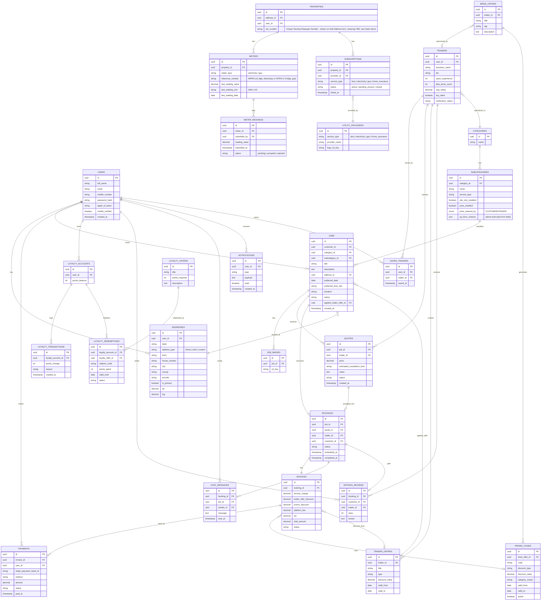
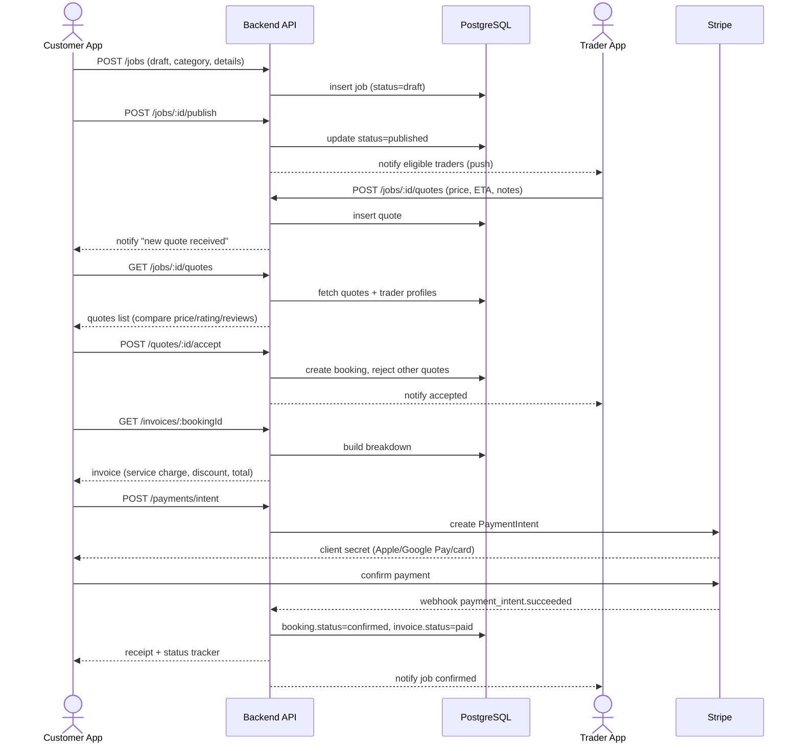
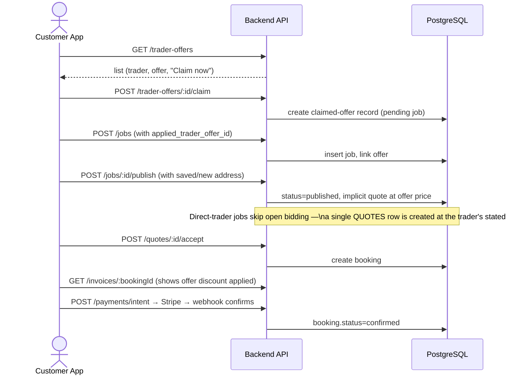
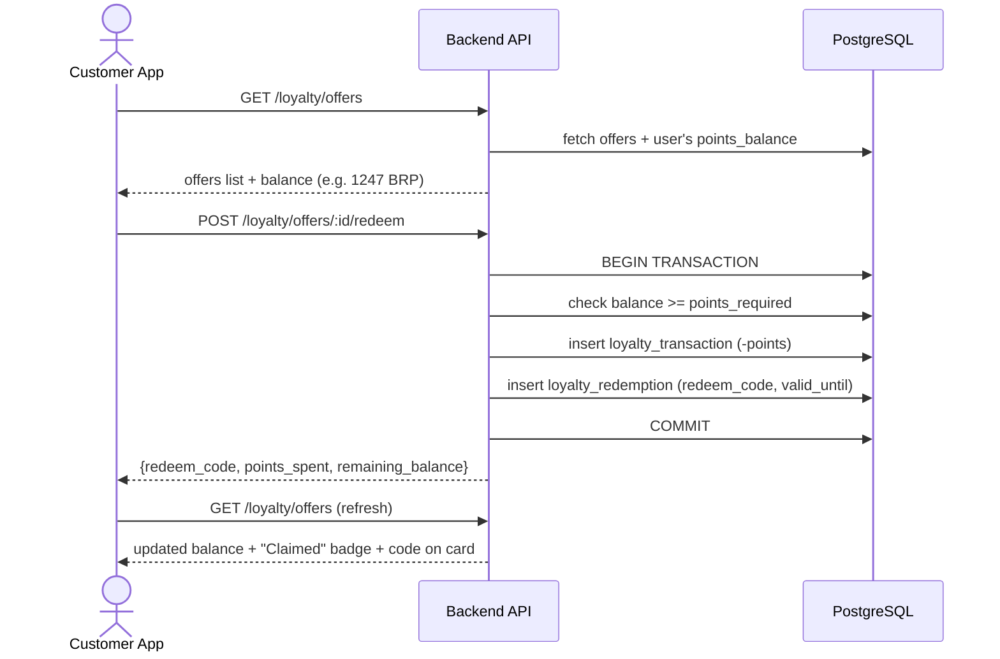
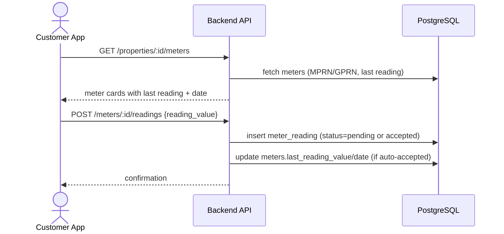
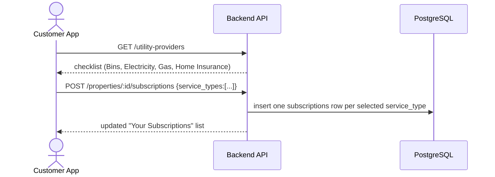
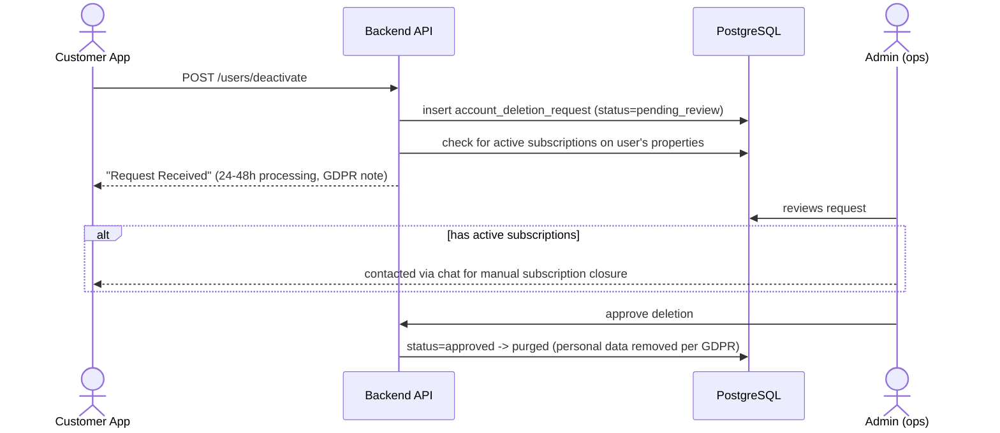

# BRISK Platform — Backend Architecture & Build Plan (v1)

> **Purpose of this document:** This is the master planning file to hand to Cursor so we can build the BRISK Node.js backend step-by-step. It consolidates everything from the process docs (Consumer App Journey, Direct Traders Offer Flow, Quote-wise Offer Flow, Brisk Offer Flow, Loyalty Flow) and the Microservices vs Monolith decision doc.
>
> **Status: WORK IN PROGRESS.** This is not the final/complete requirement set. Several flows (Trader App side, admin panel, disputes, refunds edge-cases, exact commission model, KYC/verification of traders, subscription "Premium Utility Pack", exact push/SMS providers, utility-provider integrations) are still under discussion and will be added incrementally. Treat every section below as "current best understanding" — we will revise this file as decisions are confirmed, not throw it away and start over.
>
> Build approach: **step by step, module by module**, starting with backend core (auth → users/traders → categories → jobs → quotes/offers → payments → loyalty → chat/notifications), each shipped and tested before moving to the next.
>
> **v2 update:** Actual Figma screenshots of the Customer App (Onboarding, My Property, My Address, Profile, Notifications, Offers, Post-a-Job) have now been reviewed directly (not just the process docs). This revealed a **module the process docs never mentioned at all**: **Property & Utilities Management** — a "My Property" tab where customers submit electricity/gas meter readings (MPRN/GPRN) and manage utility subscriptions (Bins, Electricity, Gas, Home Insurance). This is added as new §4A (property model), §5 (folder structure), and §6.2A (module logic) below. The architecture decision (modular monolith, no microservices) is unchanged and reconfirmed.

---

## 0. Source Material Used to Build This Plan

| Document | What it gave us |
|---|---|
| `BRISK_Consumer_App_User_Journey_&_Functional_Flow_Document.docx` | End-to-end customer journey: onboarding, job posting, quotes, payment, job execution, reschedule, cancellation, booking/payment history |
| `BRISK_Direct_Traders_Offer_Flow.docx` | Screen-by-screen flow where customer picks a **specific trader's offer first**, then posts a job against it |
| `BRISK_Quote_wise_Offer_Flow.docx` | Screen-by-screen flow where customer **posts a job publicly**, receives multiple quotes, compares, chats, accepts one |
| `BRISK_Offer_Flow.docx` | "Brisk Offers" (platform-curated offers from traders) + promo code redemption during checkout |
| `BRISK_Loyalty_Process_Documentation_EN.docx` | BRISK Points (BRP) balance, claiming loyalty offers, redemption codes |
| `BRISK_Microservices_vs_Monolith_Simple_Comparison.pdf` | Architecture decision input — see §1 |
| `BRISK_Logo.pdf` | Brand only (BRISK — "Making Things Quicker") — no functional content |
| **35 screenshots — BRISK Admin Panel** (live build, Aug 2026) | Highest-fidelity admin source for this update. Covers: Dashboard KPIs + activity chart + audit log; Category Master; Customers Directory; Traders Management + Verification queue; Jobs & Services status tabs; Marketplace Offer Management; Reports (Revenue with **10% platform fee**, Offers performance, Category performance, Reviews, Platform Activity/compliance); **Website Management → CMS** (Dashboard, Website Pages, Social Links, Knowledge Hub, Blog Posts + Create Article modal, Blog Categories + Create Category modal, FAQ + Add FAQ modal, Testimonials + Add Testimonial modal, Legal & Policies versioning, Global SEO & robots.txt); **Survey Management** (Consumer Launch Party Registrations CRM). Full breakdown in **§14**. |
| Figma proto links (Customer App UI, Trader UI App) | Still **could not be auto-fetched** — Figma proto links require an authenticated session and are blocked for automated tools. The 19 screenshots above cover a meaningful chunk of the Customer app directly; the Trader UI App proto link is still unreviewed. See §12. |

---

## 1. Architecture Decision: Modular Monolith First

Per the internal comparison doc, at BRISK's current stage (startup, small-to-medium team, Node.js + PostgreSQL) a **well-structured modular monolith on Express.js** is the right call, not microservices yet:

- A single, well-built monolith comfortably handles **2,000–20,000 concurrent users** on 1–4 mid-size servers (Stack Overflow runs its entire Q&A platform on 9 servers this way).
- Estimated cost at BRISK's scale: **~$90–1,000/month** vs **$500–5,000+/month** for microservices.
- Faster to build, one deployable unit, one codebase, easier for a small team to reason about and secure.
- Microservices only start to win once BRISK needs millions of users or very uneven load per feature (that's a "later" problem, not a "day 1" problem).

**Decision:** Build a **modular monolith** — one Express.js app, cleanly separated into self-contained **feature modules** (each with its own routes/controller/service/model), sharing one PostgreSQL database. This is structured so that if/when a specific module (e.g. Payments, or Notifications) needs to be pulled out into its own service later, the boundaries already exist and it's an extraction, not a rewrite.

> **Reconfirmed:** No microservices anywhere in this plan — this applies to every module added below, including the new Property & Utilities module. It lives inside the same monolith as `src/modules/property/`, same as every other module.

---

## 2. Recommended Tech Stack

| Layer | Choice | Notes |
|---|---|---|
| Runtime | Node.js (LTS) + TypeScript | TypeScript strongly recommended for a team building with Cursor — catches shape mismatches across modules early |
| Web framework | Express.js | Per architecture decision |
| Database | PostgreSQL (AWS RDS) | Relational — job/quote/payment/loyalty data is highly relational |
| ORM | Prisma (or Sequelize) | Prisma recommended for TS-native migrations + type safety |
| Auth | JWT (access + refresh tokens) + OTP for mobile verification + device biometric unlock | Screens show an **in-app "Face ID" screen** (separate from OS-level Apple Sign-In) with "Biometric system active" / "Sign in with Face ID" / "Use Password Instead". Backend implication: this is the standard **local biometric unlocks a device-stored refresh token** pattern — the phone's Face ID/fingerprint API never sends biometric data to BRISK; the app unlocks its secure-storage refresh token locally, then calls the normal `POST /auth/refresh`. No new biometric data touches the backend. If true Apple Sign-In (Face ID as OS login) is also wanted separately, that stays a distinct `POST /auth/apple-signin` path — to confirm which one(s) BRISK wants. |
| File/image storage | AWS S3 | Job photos, trader profile photos, ID/KYC docs, receipts |
| CDN | AWS CloudFront in front of S3 | Serve images fast to mobile apps |
| Realtime (chat, live quote updates, notifications) | Socket.IO (or AWS API Gateway WebSockets later) | Chat with Trader, live "new quote received" updates |
| Push notifications | Firebase Cloud Messaging (Android) + APNs (iOS) via a unified service | Job status changes, new quote, chat message, offer claimed |
| SMS/OTP | AWS SNS or Twilio | OTP verification on registration |
| Transactional email | AWS SES | Receipts, password reset, confirmations |
| Payments | Stripe (confirmed by docs — "powered by Stripe") | Apple Pay / Google Pay via Stripe's payment element; card payments direct |
| Background jobs / queues | AWS SQS + a worker process (BullMQ optional if Redis is introduced) | Payment webhooks, notification fan-out, reminder emails |
| Caching / rate limiting | Redis (AWS ElastiCache) — optional for v1, needed once traffic grows | Session/rate-limit store, category list caching |
| Hosting | AWS ECS Fargate (containerized Express app) or Elastic Beanstalk for v1 simplicity | Start simple (Beanstalk / single ECS service), containerize from day 1 so moving to Fargate/EKS later is trivial |
| Infra as code | Terraform or AWS CDK | Recommended once infra stabilizes, not required for local dev |
| API docs | OpenAPI/Swagger (`swagger-jsdoc` + `swagger-ui-express`) | So the Customer app / Trader app / Cursor all work off one contract |
| Logging/monitoring | CloudWatch Logs + a structured logger (pino/winston) | |
| Validation | Zod (pairs well with TypeScript) | Request-level validation per module |

---

## 2A. Confirmed App Information Architecture (from screenshots)

Bottom navigation on the Customer App is confirmed across multiple screens as **5 tabs**:

```
Jobs   |   Property   |   Offers   |   Messages   |   Profile
```

- **Jobs** — active/completed/cancelled job list (matches Consumer Journey §8 Booking History), this is the app's home/default tab.
- **Property** — **new module**, two sub-tabs: **My Property** (meter readings + subscriptions) and **My Address** (saved address book). See §4A/§6.2A.
- **Offers** — two sub-tabs: **Traders Offers** and **Brisk Offers** (matches the two offer-flow docs), each with its own filter modal.
- **Messages** — chat threads (matches §6.10 Chat module).
- **Profile** — account, bookings, addresses, preferences, log out (matches §6.2 Users module, extended below).

A bell icon (top right, with unread dot) opens the **Notifications** screen from any tab.

---

## 3. High-Level System Architecture

```mermaid
flowchart TB
    subgraph Clients
        CA[Customer App - iOS/Android]
        TA[Trader App - iOS/Android]
    end

    subgraph AWS
        CF[CloudFront CDN]
        ALB[Load Balancer]
        subgraph ECS["ECS Fargate / Beanstalk"]
            APP[Express.js Monolith\n(Modular: Auth, Users, Traders, Property/Utilities,\nJobs, Quotes, Offers, Payments,\nLoyalty, Chat, Notifications)]
        end
        WS[Socket.IO Realtime Layer]
        RDS[(PostgreSQL - RDS)]
        S3[(S3 - Images/Docs/Receipts)]
        SQS[[SQS Queues]]
        WORKER[Background Worker\n(notifications, webhooks, reminders)]
        SES[SES - Email]
        SNS[SNS - OTP/SMS]
        SECRETS[Secrets Manager]
    end

    subgraph ThirdParty
        STRIPE[Stripe - Payments/Apple Pay/Google Pay]
        FCM[FCM/APNs - Push]
        MAPS[Maps/Places API - Location search]
    end

    CA -->|HTTPS| ALB
    TA -->|HTTPS| ALB
    CA -.->|WebSocket| WS
    TA -.->|WebSocket| WS
    ALB --> APP
    WS --> APP
    APP --> RDS
    APP --> S3
    CF --> S3
    APP --> SQS
    SQS --> WORKER
    WORKER --> SES
    WORKER --> FCM
    APP --> SNS
    APP --> STRIPE
    APP --> MAPS
    APP --> SECRETS
```

---

## 4. Core Domain / ER Diagram

This covers the entities identified across all five process docs, plus the Property & Utilities entities confirmed from the Figma screenshots (§4A).



> Note: `INVOICES` deliberately carries **both** `trader_offer_discount` and `promo_discount` as separate columns because the docs show these as two distinct discount sources that can appear on the same invoice (Direct Trader Offer discount vs a Brisk promo code applied at checkout).

---

## 4A. New Module: Property & Utilities Management

This is not in any of the five process docs — it surfaced only from the Figma screenshots ("My Property" and "My Address" tabs under the new **Property** bottom-nav item). Documenting it fully here since it's a real, screen-complete feature:

**My Property tab:**
- An address selector at the top (`Select Address` dropdown) — a property is really just "an address the customer manages utilities for," 1:1 with an `ADDRESSES` row (see `PROPERTIES` entity, which extends an address rather than duplicating it).
- **Electricity meter card**: shows MPRN (Meter Point Reference Number, an 11-digit code unique to the property, per the in-app tooltip), last reading value + unit (kWh) + date, and an input to submit a new reading.
- **Gas meter card**: same pattern with GPRN (Gas Point Registration Number, 7–8 digit code per tooltip), unit m³.
- **Your Subscriptions** list: shows which utility/service providers are currently linked to this property — seen examples: Bins (Dublin City Council), Electricity (Electric Ireland), Gas (Bord Gáis Energy). Each row is tappable (chevron) for more detail.
- **Add Subscription** (bottom button, opens modal): checklist of available services — Bins, Electricity, GAS, Home Insurance — each with a provider name shown under it; user ticks the ones they want BRISK to manage and taps **Save Subscription**. Copy explicitly states "You can manage these at any time in your profile."

**My Address tab:**
- List of saved addresses (Home marked `Primary` badge, Work, etc.), each with edit/delete icons.
- **Add Address modal**: type toggle (Home / Work / Custom), a map picker (pin drop), then form fields: Street Address, House/Apartment No, **MPRN Number**, **GPRN Number**, **UTN Number** (meaning not yet confirmed — see Open Items), City, County, Eircode.
- This confirms `ADDRESSES` needs the extended field set now reflected in §4's ER diagram (`address_type`, `house_number`, `county`, `eircode`, `is_primary`), and that MPRN/GPRN can be captured **either** at address-creation time **or** later against a specific meter — the backend should treat "meter reference number" as upsertable independently of the address form (a customer might add the address first and the MPRN later once they find their bill).

**Backend implication — read carefully:** BRISK does **not** appear to be reading meters or utility accounts live from Electric Ireland / Bord Gáis / Dublin City Council via API integration (nothing in the screens suggests OAuth/account-linking with those providers). The most defensible v1 interpretation is: **customers self-report meter readings** (BRISK stores them, perhaps for record-keeping or to attach to a job like "submit a reading before a boiler service") and **subscriptions are just a saved list of which providers apply to this property** (metadata, not a live account link). This needs explicit confirmation — see §11 Open Items — before building any provider-integration work.

---

## 5. Backend Project Folder Structure

Feature-module (a.k.a. "vertical slice") structure — each module owns its routes, controller, service, validation, and (if module-specific) model file. Shared/global model definitions live in `database/models`.

```
brisk-backend/
├── src/
│   ├── config/
│   │   ├── env.ts                  # loads & validates env vars
│   │   ├── database.ts             # Prisma/Sequelize client init
│   │   ├── aws.ts                  # S3, SES, SNS, SQS clients
│   │   ├── stripe.ts               # Stripe client init
│   │   └── swagger.ts              # OpenAPI setup
│   │
│   ├── modules/
│   │   ├── auth/
│   │   │   ├── auth.routes.ts
│   │   │   ├── auth.controller.ts
│   │   │   ├── auth.service.ts       # register, login, refresh, apple sign-in
│   │   │   ├── otp.service.ts        # generate/verify OTP via SNS/Twilio
│   │   │   ├── auth.validation.ts    # zod schemas
│   │   │   └── auth.types.ts
│   │   │
│   │   ├── users/
│   │   │   ├── users.routes.ts
│   │   │   ├── users.controller.ts
│   │   │   ├── users.service.ts      # profile CRUD, stats (jobs posted, avg rating, saved traders)
│   │   │   ├── account-deletion.service.ts # deactivation request, GDPR purge workflow
│   │   │   └── users.validation.ts
│   │   │
│   │   ├── traders/
│   │   │   ├── traders.routes.ts
│   │   │   ├── traders.controller.ts
│   │   │   ├── traders.service.ts    # profile, stats, verification status
│   │   │   └── traders.validation.ts
│   │   │
│   │   ├── property/
│   │   │   ├── addresses/
│   │   │   │   ├── addresses.routes.ts
│   │   │   │   ├── addresses.controller.ts
│   │   │   │   └── addresses.service.ts    # My Address tab: CRUD, primary flag, geocoding
│   │   │   ├── meters/
│   │   │   │   ├── meters.routes.ts
│   │   │   │   ├── meters.controller.ts
│   │   │   │   └── meters.service.ts       # MPRN/GPRN registration, reading submission/history
│   │   │   └── subscriptions/
│   │   │       ├── subscriptions.routes.ts
│   │   │       ├── subscriptions.controller.ts
│   │   │       └── subscriptions.service.ts # link/unlink utility providers per property
│   │   │
│   │   ├── categories/
│   │   │   ├── categories.routes.ts
│   │   │   ├── categories.controller.ts
│   │   │   └── categories.service.ts # category/subcategory tree, Residential/Commercial filter
│   │   │
│   │   ├── jobs/
│   │   │   ├── jobs.routes.ts
│   │   │   ├── jobs.controller.ts
│   │   │   ├── jobs.service.ts       # create/publish/reschedule/cancel job
│   │   │   ├── jobs.validation.ts
│   │   │   └── job-images.service.ts # S3 upload for job photos
│   │   │
│   │   ├── quotes/
│   │   │   ├── quotes.routes.ts
│   │   │   ├── quotes.controller.ts
│   │   │   └── quotes.service.ts     # trader submits quote, customer compares/accepts
│   │   │
│   │   ├── offers/
│   │   │   ├── trader-offers/
│   │   │   │   ├── trader-offers.routes.ts
│   │   │   │   ├── trader-offers.controller.ts
│   │   │   │   └── trader-offers.service.ts   # "Claim now" direct-trader offers
│   │   │   ├── brisk-offers/
│   │   │   │   ├── brisk-offers.routes.ts
│   │   │   │   ├── brisk-offers.controller.ts
│   │   │   │   └── brisk-offers.service.ts    # curated offers list + tags
│   │   │   └── promo-codes/
│   │   │       ├── promo-codes.routes.ts
│   │   │       ├── promo-codes.controller.ts
│   │   │       └── promo-codes.service.ts     # validate/apply code to invoice
│   │   │
│   │   ├── bookings/
│   │   │   ├── bookings.routes.ts
│   │   │   ├── bookings.controller.ts
│   │   │   └── bookings.service.ts   # booking status machine, history, details
│   │   │
│   │   ├── invoices/
│   │   │   ├── invoices.routes.ts
│   │   │   ├── invoices.controller.ts
│   │   │   └── invoices.service.ts   # builds breakdown (service charge, discounts, fees, tax)
│   │   │
│   │   ├── payments/
│   │   │   ├── payments.routes.ts
│   │   │   ├── payments.controller.ts
│   │   │   ├── payments.service.ts   # Stripe PaymentIntents, Apple/Google Pay
│   │   │   ├── payments.webhook.ts   # Stripe webhook handler
│   │   │   └── billing.validation.ts # individual vs company billing
│   │   │
│   │   ├── loyalty/
│   │   │   ├── loyalty.routes.ts
│   │   │   ├── loyalty.controller.ts
│   │   │   └── loyalty.service.ts    # points balance, claim/redeem, redeem codes
│   │   │
│   │   ├── ratings/
│   │   │   ├── ratings.routes.ts
│   │   │   ├── ratings.controller.ts
│   │   │   └── ratings.service.ts
│   │   │
│   │   ├── chat/
│   │   │   ├── chat.routes.ts
│   │   │   ├── chat.controller.ts
│   │   │   ├── chat.service.ts
│   │   │   └── chat.gateway.ts       # Socket.IO namespace/events
│   │   │
│   │   ├── notifications/
│   │   │   ├── notifications.routes.ts
│   │   │   ├── notifications.controller.ts
│   │   │   ├── notifications.service.ts
│   │   │   └── push.service.ts       # FCM/APNs dispatch
│   │   │
│   │   ├── uploads/
│   │   │   ├── uploads.routes.ts
│   │   │   ├── uploads.controller.ts
│   │   │   └── s3.service.ts         # pre-signed URLs
│   │   │
│   │   └── admin/                    # internal/ops endpoints (later phase)
│   │       ├── admin.routes.ts
│   │       └── admin.controller.ts
│   │
│   ├── database/
│   │   ├── schema.prisma             # (if Prisma) full schema from §4
│   │   ├── migrations/
│   │   └── seeders/
│   │       ├── categories.seed.ts
│   │       └── demo-data.seed.ts
│   │
│   ├── middlewares/
│   │   ├── auth.middleware.ts        # verify JWT, attach req.user
│   │   ├── role.middleware.ts        # customer vs trader vs admin guard
│   │   ├── error.middleware.ts       # centralized error handler
│   │   ├── rateLimiter.middleware.ts
│   │   └── validate.middleware.ts    # zod schema wrapper
│   │
│   ├── jobs-queue/                   # background workers (naming avoids clash with "jobs" domain module)
│   │   ├── notification.worker.ts
│   │   ├── payment-webhook.worker.ts
│   │   └── reminder.worker.ts        # reschedule/cancellation reminders
│   │
│   ├── sockets/
│   │   └── socket-server.ts          # Socket.IO bootstrap, auth handshake
│   │
│   ├── utils/
│   │   ├── logger.ts
│   │   ├── apiResponse.ts
│   │   ├── errors.ts
│   │   └── pagination.ts
│   │
│   ├── app.ts                        # express app, middleware wiring, route mounting
│   └── server.ts                     # http server bootstrap, graceful shutdown
│
├── tests/
│   ├── unit/
│   └── integration/
│
├── docker-compose.yml                # local Postgres + app for dev
├── Dockerfile
├── .env.example
├── package.json
└── tsconfig.json
```

---

## 6. Module-by-Module Logic (mapped to the process docs)

### 6.1 Auth Module
- `POST /auth/register` — full name (photo optional via `Add Photo`), email, phone number (with country dial code, e.g. `+353`), password → creates unverified user, triggers OTP. Password rules confirmed on-screen: **min 8 characters, one uppercase letter, one number/special character** (live checklist UI) — enforce the same rules server-side in `auth.validation.ts`, don't trust client-side checks alone. Terms & Privacy checkbox required before submit.
- `POST /auth/verify-otp` — verifies OTP, activates account.
- `POST /auth/login` — email + password → JWT access + refresh token.
- `POST /auth/forgot-password` — email → sends **password-reset SMS OTP** to the user's registered mobile (same mock `123456` until SNS/Twilio ships). Always returns the same generic message whether or not the email exists; when the account is found, response includes `data.mobileNumber`, `data.requiresPasswordReset=true`, and `data.otpSent`. Works for **Customer and Trader** roles. Blocked/suspended/inactive accounts return `403`.
- `POST /auth/verify-reset-otp` — `{ mobileNumber, code }` → verifies password-reset OTP only, returns short-lived `resetToken` (15 min). **Do not use** `POST /auth/verify-otp` for forgot-password (that endpoint is signup activation only).
- `POST /auth/reset-password` — preferred `{ resetToken, newPassword }` (no OTP again). Legacy one-shot `{ mobileNumber, code, newPassword }` still works. If mobile already verified → returns tokens (auto-login). If mobile still pending → returns `requiresOtpVerification`. Password rules same as register.
- **Biometric ("Face ID") login** — screens show a dedicated in-app Face ID screen ("Biometric system active" / "Sign in with Face ID" / "Use Password Instead"), separate from the login screen's own "Face ID" shortcut button. This is standard **local-biometric-unlocks-stored-refresh-token** UX: the phone's OS biometric API unlocks a refresh token the app already stored in secure device storage after a prior password login; the app then just calls `POST /auth/refresh` as normal. **No biometric data is ever sent to or processed by the backend.** No new endpoint is strictly required beyond refresh — flag if BRISK instead wants server-side "device trust" tracking (e.g. `POST /auth/devices/register` to list/revoke trusted devices from Security settings).
- `POST /auth/apple-signin` — verifies Apple identity token, only if native Sign in with Apple is also wanted as a separate path (to confirm — see Open Items).
- `POST /auth/refresh`, `POST /auth/logout`.
- Same module serves both Customer app and Trader app; a `role` field (`customer` / `trader`) on the user record plus a `traders` profile record when role = trader.

### 6.2 Users & Traders Modules
- Users: profile CRUD (Display Name, Email — shown **read-only/locked** with a padlock icon once set, Phone with country code), preferences (Notifications on/off toggle).
- Profile screen shows three **derived stats**: Jobs Posted, Avg Rating (as a customer, if BRISK collects ratings both ways — to confirm), Saved Traders (count from the new `SAVED_TRADERS` table — a "favorite trader" feature not previously documented; needs a `POST /traders/:id/save` / `DELETE /traders/:id/save` pair).
- **Account deactivation** (confirmed via 3-dot menu → "Deactivate Account"): `POST /users/deactivate` creates a deletion request in `pending_review` status, does **not** delete data immediately. Response screen explicitly states: processing window **24–48 hours**, data is "permanently purged following GDPR compliance protocols" once approved, and "an admin might reach out via chat if any active subscriptions need manual closure" — meaning deactivation must check for `SUBSCRIPTIONS` rows in `active` status on the user's properties and flag them for manual admin closure before final purge. Model this as a real workflow, not a soft-delete flag: `ACCOUNT_DELETION_REQUESTS(id, user_id, status[pending_review|admin_contacted|approved|purged|cancelled], requested_at, processed_at)`.
- Traders: profile (photo, bio, years of experience, jobs-done counter, avg rating, "Top Rated" badge, verification status), category specialization.
- `jobs_done_count` and `avg_rating` are **derived/denormalized** fields, recalculated whenever a booking completes or a rating is submitted (via a service method, not client-writable).

### 6.2A Property & Utilities Module (new — see §4A)
- `GET /properties` / `GET /properties/:id` — property = an address the user manages utilities for.
- `GET /properties/:id/meters`, `POST /properties/:id/meters` — register an MPRN (electricity) or GPRN (gas) meter against a property; both can be added at address-creation time or later.
- `POST /meters/:id/readings` — submit a new reading; keep every submission in `METER_READINGS` (append-only history) and update `METERS.last_reading_value/date` only after a reading is accepted — this also gives BRISK a natural audit trail if a provider later disputes a reading.
- `GET /properties/:id/subscriptions`, `POST /properties/:id/subscriptions` (bulk — matches the "Add New Subscription" checklist UI, which saves multiple ticked services in one action), `DELETE /subscriptions/:id`.
- `GET /utility-providers?service_type=` — reference list backing the checklist (Bins/Electricity/Gas/Home Insurance), seeded, admin-managed.
- No live provider API integration assumed for v1 (see §4A) — flag immediately if that assumption is wrong, since it changes this module significantly (OAuth/account-linking, provider webhook handling, etc.).

### 6.3 Categories Module
- Category → Subcategory tree (Residential/Commercial toggle, matches "All Sub-Category" screen).
- Read-mostly, cached at the app layer (Redis once introduced) since this data changes rarely.
- **Sub-category flags (admin):**
  - `siteVisitEnabled` — turn site visit on/off for that service.
  - `priceEnabled` — show or hide the price field when posting a job.
  - `priceEnteredBy` — `CUSTOMER` or `TRADER` (who fills the price when the price field is shown).
- **Sub-category Q&A form builder:** Admin builds a form when creating/editing a sub-category and saves it as JSON (`qaFormSchema`). Supported field types: `text`, `textarea`, `number`, `dropdown`, `single_choice`, `multi_choice`, `date`, `boolean`. When a customer/trader posts a job for that sub-category, the app renders this form and stores answers on the job as `qaFormAnswers` JSON.
- **App read APIs (no admin token):** `GET /categories`, `GET /categories/:id`, `GET /categories/slug/:slug`, `GET /sub-categories`, `GET /sub-categories/:id` — active-only; list endpoints return `data` as an array plus `meta` (`total`, `page`, `limit`, `totalPages`) with `?page=&limit=` (default page 1, limit 20, max 100); detail endpoints return `data` as the object directly. Each sub-category includes `siteVisitEnabled`, `priceEnabled`, `priceEnteredBy`, `qaFormSchema`. Swagger tag **Mobile / Categories**.
- **Jobs create API** (accepting `qaFormAnswers`) still pending Phase 2 Jobs module — DB column already exists.

### 6.4 Jobs Module (Job Posting Flow)
Implements Consumer Journey §2 and the "Post a New Job" screens common to all three offer flows:
- `POST /jobs` — create job draft: category, subcategory, title, description, date, time slot, duration, phone, specific requirements, photo uploads (pre-signed S3 URLs), optional `applied_trader_offer_id` (Direct Trader flow) or none (Quote-wise flow, public post).
- `POST /jobs/:id/publish` — validates address chosen, sets status `published`, becomes visible to eligible traders (matched by category + service radius).
- `PATCH /jobs/:id/reschedule` — new date/time, notifies assigned trader, requires trader acceptance to confirm.
- `PATCH /jobs/:id/cancel` — reason required, triggers refund logic per cancellation policy, notifies trader.
- Job status machine: `draft → published → quoted → accepted → confirmed → in_progress → completed` (+ `cancelled` branch at any pre-completion state, + `reschedule_requested`).

### 6.5 Quotes Module
Two paths converge here:
- **Direct Trader Offer flow**: job is posted *at* a specific trader (their offer pre-applied) — effectively an implicit quote at that trader's stated price; still modeled as a `QUOTES` row so downstream invoice/payment logic is identical regardless of path.
- **Quote-wise Offer flow**: job is public, multiple traders each `POST /jobs/:id/quotes` with price, estimated completion time, notes. Customer calls `GET /jobs/:id/quotes` to compare (price, rating, experience, reviews), then `POST /quotes/:id/accept`.
- Accepting a quote creates a `BOOKING` and marks the other quotes `rejected`/`expired`.

### 6.6 Offers Module (three distinct sub-flows, kept as separate services under one `offers/` folder because their data and screens genuinely differ)
- **Trader Offers** (`Traders Offers` tab): individual trader-authored offers ("€5 off first job", "Waived service fee", "5% Cash back") — each card shows a small type icon (cash/piggy-bank/percent) driven by an `offer_type` field. `POST /trader-offers/:id/claim` links the offer to the customer's *next* job for that trader — this is the discount later shown as `trader_offer_discount` on the invoice. Claiming pre-fills the "Post a New Job" screen with an offer banner (confirmed on screen) and carries the discount through to the price shown on the trader's profile ("Post Your Job" button shows the discounted total).
- **Confirmed filter modal** (`GET /trader-offers?...`) supports: `date_range` (`today|yesterday|last_7_days|last_30_days|custom` with `from`/`to`), `trader_ids[]` (multi-select, with search-as-you-type), `offer_type` (`percentage|flat_amount`), `category_id` (multi-select with icon per category). Build this as real query params, not a single opaque "filter" blob, so each control maps 1:1 to a param.
- **Brisk Offers** (`Brisk Offers` tab): platform-curated offers tied to a trader ("10% off Pest Control services", "Free Electrical Inspection"), each with a `tag` field (`special_local_promo`, `limited_availability`, etc.) and a distinct action-button label per offer (`Claim Offer` vs `Book Inspection` — model as a `cta_label`/`cta_action` pair rather than hardcoding "claim" everywhere, since "Book Inspection" implies a different downstream flow than a discount claim). Screen also shows the BRISK points balance inline even though this tab is about discounts, not points — just a persistent header, no functional link to redemption.
- **Promo Codes**: BRISK-issued codes (e.g. `PEST10BRISK`, `ALL10BRISK`) searchable/filterable by category, applied at the **invoice/checkout step** (not tied to a specific job upfront) via `POST /invoices/:id/apply-promo`. Validated for category scope, validity window, and (recommended, to confirm) one-use-per-customer.

### 6.7 Bookings & Invoices Modules
- A `BOOKING` is created the moment a quote is accepted (either path).
- `InvoiceService.buildBreakdown(bookingId)` computes: service charge → minus trader-offer discount (if any) → minus promo discount (if applied) → plus platform fee (if applicable) → plus tax → total. This exact structure matches all three flow docs' "Breakdown" sections.
- `GET /bookings/:id` returns full booking detail screen data (booking number, category, description, images, address, schedule, trader info, quote, payment summary, timeline, current status) — matches Consumer Journey §9 "Booking Details".
- `GET /bookings?status=active|completed|cancelled|rescheduled` — matches §8 "Booking History".

### 6.8 Payments Module
- `POST /payments/intent` — creates a Stripe PaymentIntent for the invoice total; supports card, Apple Pay, Google Pay (all via Stripe's unified Payment Element — docs explicitly say "powered by Stripe").
- Billing details: `individual` vs `company` (company adds `company_name` + `tin_number`) — stored against the invoice/payment record, not the user profile, since billing details can differ per transaction.
- `POST /payments/webhook` — Stripe webhook (payment_intent.succeeded/failed) is the **source of truth** for marking payment complete — never trust the client-side "success" callback alone. On success: booking status → `confirmed`, receipt generated, notifications fired to both parties (matches "Payment Success" screen with Transaction ID, receipt summary, status tracker Paid→Confirmed→Service).
- `GET /payments/history` — matches §10 Payment History.

### 6.9 Loyalty Module
- `LOYALTY_ACCOUNTS.points_balance` per user (BRP — Brisk Reward Points).
- `GET /loyalty/offers` — list with required BRP per offer.
- `POST /loyalty/offers/:id/redeem` — atomic transaction: check balance ≥ required points → deduct points (insert `LOYALTY_TRANSACTIONS` row, negative) → create `LOYALTY_REDEMPTIONS` row with a generated unique `redeem_code` and validity window → return code + updated balance. This must run inside a DB transaction to prevent double-redeem race conditions (two taps of "Confirm Redemption" from the same or two devices).
- `GET /loyalty/redemptions` — powers the "Claimed" badge + redeem code shown on the updated offers list.

### 6.10 Chat Module
- Per-booking (or per-job pre-acceptance, per the "Chat with Trader" screen shown before a quote is accepted) thread.
- REST for history (`GET /chat/:threadId/messages`) + Socket.IO for live send/receive and read receipts.
- Chat screen can surface a "quote summary card" inline and allow accepting a quote directly from chat — so `chat.service` needs a reference to `quotes.service.accept()`.

### 6.11 Ratings & Reviews Module
- Created only after a booking reaches `completed` (Consumer Journey §5) — customer prompted to rate + optional review.
- On insert, recompute the trader's `avg_rating` and increment `jobs_done_count`.

### 6.12 Notifications Module
- Internal event bus (simple in-process EventEmitter is fine for v1 monolith) → `notifications.service` persists a `NOTIFICATIONS` row and enqueues a push job via SQS → worker sends via FCM/APNs.
- Screen confirms notifications are grouped by date (`Today`, `Earlier this week`, ...) with a `type` driving the icon — **confirmed types so far**: `new_offer` (e.g. "Get 10% off your next plumbing service!"), `payment_successful` (references an invoice number), `review_reminder` (nudges to rate a completed job), `security_update` (e.g. "Your password was changed successfully"). Model `type` as an extensible enum, not a fixed set — more will surface once the Trader app and other flows are reviewed.
- Trigger points already identified across the docs: new quote received, offer claimed, payment success, job confirmed, reschedule request/response, cancellation, chat message, job completed (rating prompt), password/security changes, new promotional offer.

### 6.13 Uploads Module
- Pre-signed S3 PUT URLs issued to the client (mobile apps upload directly to S3, not through the API server) — for job photos, trader profile photos, and receipts/invoices (PDF, generated server-side and stored in S3, downloadable per §10).

---

## 7. Key Sequence Diagrams

### 7.1 Quote-wise Offer Flow (public job → compare quotes → pay)



### 7.2 Direct Trader Offer Flow (offer-first)



### 7.3 Loyalty Redemption



### 7.4 Submit Meter Reading (My Property)



### 7.5 Add Subscription (My Property)



### 7.6 Account Deactivation (GDPR-aware)



---


| Need | Service | Notes |
|---|---|---|
| Compute | ECS Fargate (or Elastic Beanstalk for the fastest v1 start) | Containerized Express app |
| Database | RDS for PostgreSQL | Multi-AZ once past MVP |
| File storage | S3 | Buckets: `brisk-job-images`, `brisk-trader-docs`, `brisk-receipts` |
| CDN | CloudFront | In front of the public image bucket |
| Queue | SQS | Decouples notification/webhook processing from request path |
| Email | SES | Receipts, verification emails |
| SMS/OTP | SNS (or Twilio if SNS SMS delivery/coverage is insufficient for target countries) | To confirm based on target markets (docs show €/Dublin/Berlin examples → EU) |
| Secrets | Secrets Manager | Stripe keys, DB creds, JWT secret |
| Monitoring | CloudWatch | Logs, alarms on error rate/latency |
| DNS/TLS | Route 53 + ACM | |
| CI/CD | CodePipeline/CodeBuild, or GitHub Actions → ECR → ECS | Either is fine; GitHub Actions is simplest to start |

---

## 9. Payments & Discount Stacking — Confirmed Logic

From all three offer-flow docs, an invoice can carry **up to two discount types simultaneously** (a trader offer AND a promo code have both appeared stacked in the same breakdown in the docs):

```
Total = Service Charge
        − Trader/Brisk Offer Discount (if a trader/brisk offer was claimed pre-job)
        − Promo Code Discount (if applied at checkout, separately)
        + Platform Fee (**10%** of service charge — confirmed via Admin Reports Revenue screen, §14.7.1)
        + Tax (if applicable)
```

Billing: `individual` (full name, address, city, postal code) or `company` (+ company name, TIN number) — captured **at checkout**, not on the user profile, since a customer may switch between the two per transaction.

Payment methods (all via Stripe): Apple Pay, Google Pay, Credit/Debit Card.

---

## 10. Build Order (Step-by-Step for Cursor)

Build and ship in this order — each phase should be runnable/testable before starting the next.

1. **Phase 0 — Foundation**: repo scaffold, TypeScript config, Express app skeleton, Docker Compose (local Postgres), env config, health-check route, error middleware, logger, Swagger scaffold.
2. **Phase 1 — Auth & Users**: register/OTP/login/refresh, Apple Sign-In, JWT middleware, role guard, Users module (profile, stats, deactivation workflow), Traders module (profile).
3. **Phase 1B — Property & Utilities**: Addresses (My Address tab, Add Address modal), Meters (MPRN/GPRN registration + reading submission), Subscriptions (utility provider checklist). Independent of Jobs/Payments — can be built in parallel with Phase 2.
4. **Phase 2 — Categories & Jobs**: category/subcategory seed + endpoints, Jobs module full CRUD + publish + reschedule + cancel, S3 pre-signed upload for job photos.
5. **Phase 3 — Quotes & Offers**: Quotes module (submit/compare/accept), Trader Offers (+ filters), Brisk Offers, Promo Codes.
6. **Phase 4 — Bookings & Invoices**: booking status machine, invoice breakdown builder.
7. **Phase 5 — Payments**: Stripe integration, PaymentIntent creation, webhook handler, receipts, payment history.
8. **Phase 6 — Loyalty**: points balance, offers, redemption with transactional safety.
9. **Phase 7 — Chat & Notifications**: Socket.IO gateway, push notification worker, in-app notification feed (typed per §6.12).
10. **Phase 8 — Ratings & Booking History polish**: ratings/reviews, saved traders, booking history filters, booking details screen endpoint.
11. **Phase 9 — Admin/Ops** (as scope firms up): trader verification/KYC review, account-deletion approval queue, dispute handling, manual refunds.
12. **Phase 10 — Hardening**: rate limiting, load testing against the concurrency table in the architecture doc, CloudWatch alarms, backups.

---

## 11. Open Items / Still In Discussion

Explicitly tracking these so nothing is assumed silently — please confirm each as we get to it:

- [ ] **Trader verification/KYC** — what documents, who reviews, manual vs automated.
- [x] ~~**Platform fee & commission model**~~ — **RESOLVED (v7 screenshots):** Admin Reports → Revenue shows **Platform Fees (10%)** as an explicit KPI. Still confirm whether fee is charged to customer vs deducted from trader payout before Payments module ships.
- [ ] **Cancellation policy specifics** — refund percentages by time-to-service, who defines this (currently just "per platform's cancellation policy"). Legal CMS has a Refund & Cancellation Policy document — use that as source of truth once content is locked.
- [ ] **"Premium Utility Pack - Annual Subscription"** mentioned in Order Summary — is this a real subscription product needing its own billing module, or a placeholder in the mock data?
- [ ] **Trader-side app requirements** — this doc leans Customer-app-flow-heavy since that's what the process docs covered in depth; Trader app functional flow doc wasn't provided yet (quote submission, job acceptance, chat, payout/earnings, availability calendar all need their own pass).
- [ ] **Payouts to traders** — Stripe Connect (recommended) vs manual payout — not covered in docs yet.
- [ ] **Geolocation / job matching radius** — how traders are matched to a published job (category only, or distance-based).
- [ ] **Promo code reuse rules** — one-time per user, per code, or unlimited.
- [ ] **Target countries/currencies** — docs mix € (Dublin, Berlin) and $ (US categories) — affects Stripe account setup, tax handling, SMS provider choice.
- [ ] **Figma specs** — need actual access (see below) to lock exact field validations, error states, empty states not covered in the process docs.
- [ ] **Utility-provider integration model** — do Bins/Electricity/Gas/Home Insurance subscriptions ever connect live to Dublin City Council / Electric Ireland / Bord Gáis (OAuth, API), or are they just metadata BRISK stores about which providers apply to a property? This materially changes the Property module's scope (§4A).
- [ ] **UTN Number** — appears on the Add Address form (alongside MPRN/GPRN) with no definition anywhere in the material provided. Need to know what this stands for and its validation format before finalizing the `PROPERTIES`/`ADDRESSES` schema.
- [ ] **Meter reading acceptance** — are self-submitted readings auto-accepted, or is there a review/verification step (e.g. against a photo of the meter) before `METERS.last_reading` updates?
- [ ] **Saved Traders ("favorite trader")** — confirmed as a profile stat but no screen for browsing/managing the saved list was included yet.
- [ ] **Biometric / device-trust model** — confirm whether "Face ID" login is purely local (no backend change beyond refresh-token flow) or if BRISK also wants server-side trusted-device tracking.
- [ ] **Account deactivation vs deletion** — confirm whether "Deactivate Account" is a reversible pause or leads irreversibly into the GDPR purge workflow shown; the copy suggests the latter but the button label suggests the former.

---

## 12. Still Needed From You

1. **Remaining Figma access** — the Customer App proto link is now partially covered by the 19 screenshots reviewed (§0), but the flows not yet screenshotted (checkout/payment screens, chat, booking history/details, ratings) and the **entire Trader UI App** proto link are still blocked for automated fetching (Figma requires a logged-in session for proto/dev-mode). Please either:
   - Share more screenshots the same way you just did (works well — this update was built entirely from what you pasted in), or
   - Share Figma "Dev Mode" exports/specs (CSS/tokens/inspect JSON), or
   - Invite view access to an account usable via browser tooling in a future session.
2. **Trader App screenshots/process doc** — still the biggest gap. Everything trader-side (submit quote, accept job, chat, payout/earnings, availability, KYC upload) is inferred only from mentions inside the customer-facing material.
3. **Remaining Admin Panel screens** (see checklist in §14.12) — most urgently: Document Rules, Sub Categories detail forms, Transactions page, Survey Trader + Analytics tabs, CMS Header/Footer/Media/Email/Banner editors, Admin Users & Roles, Settings, Create Website Page / Knowledge Guide / Legal version modals.
4. Answers to the Open Items checklist above, as they get decided — I'll fold each into this file as an update rather than a rewrite.

---

## 13. Conventions for Cursor

- TypeScript strict mode on.
- One module = one folder under `src/modules/`, no cross-module DB queries — a module only touches its own tables directly; if it needs another module's data, it calls that module's service function.
- All monetary values as `decimal`/integer-cents in the DB, never floats.
- All list endpoints paginated (`?page=&limit=`) by default.
- Every mutation that touches money or points wraps in a DB transaction.
- Webhooks (Stripe) are the only source of truth for payment state — client callbacks only drive UI, never DB writes.
- Route naming: REST, plural nouns (`/jobs`, `/quotes`, `/loyalty/offers`), nested only one level deep (`/jobs/:id/quotes`, not `/jobs/:id/quotes/:id/accept` — accept is its own resource-ish action `/quotes/:id/accept`).

---

## 14. Admin Panel — Full Requirements from Live Screenshots (v7 — Aug 2026)

> **Source:** 35 admin-panel screenshots reviewed screen-by-screen (Dashboard, Masters, Customers, Traders, Jobs, Offers, Reports tabs, **Website Management → CMS (all tabs + forms)**, Survey Management). This section is the authoritative admin IA / schema / API contract until remaining unscreened pages arrive.
>
> Admin Panel is served by the **same modular monolith** under `/admin/*`, guarded by admin JWT + role (`ADMIN` | `SUPER_ADMIN`).
>
> Shared list-page pattern on every screen: **KPI cards → search + dropdown filters → data table/cards → row actions → Refresh / primary CTA → pagination**.

### 14.0 Confirmed Admin Sidebar Navigation (full IA)

```
MAIN OVERVIEW
  Dashboard

MASTERS MANAGEMENT
  Categories
  Sub Categories
  Document Rules

USER RECORDS
  Customers
    → All Customers
    → Account Verification / Deletion Requests  (badge count, e.g. 3)
    → Payment Methods
  Traders & Merchants
    → All Traders
    → Documents / Verification Queue           (badge count, e.g. 5)

OPERATIONS
  Jobs & Services
  Offers & Promotions
  Transactions

USER MANAGEMENT
  Admin Users
  Roles & Permissions

REPORTS & ANALYTICS
  Analytics Dashboard
  Customer Reports
  Trader Reports
  Jobs & Services
  Revenue & Payments
  Offers & Promotions
  Category & Service
  Reviews & Ratings
  Platform Activity

WEBSITE MANAGEMENT
  CMS Management   ← horizontal tabs (see §14.8)
  Survey Management ← tabs: Consumer / Trader / Analytics

SETTINGS
  Settings
```

Top chrome (every page): global search (“Search anything across portal”), notification bell, “System Super Admin” profile menu. Sidebar footer: logged-in admin name + role + logout.

### 14.1 Admin Dashboard (`GET /admin/dashboard/*`)

**Confirmed KPI cards** (value + MoM % delta badge):
`Total System Users`, `Verified Traders`, `Active Customers`, `Total Jobs` / `Active Service Jobs`, `Pending Verification`, `Total Revenue`, `Monthly Growth`, `Total Transactions`.

| Endpoint | Purpose |
|----------|---------|
| `GET /admin/dashboard/stats` | All 8 KPI cards + period-over-period deltas |
| `GET /admin/dashboard/activity-trend?months=12` | Dual-series chart: Transactions ($) vs Job Postings by month (+ growth badge) |
| `GET /admin/audit-logs?limit=10` | Recent Audit Log widget (`New Trader Registered`, `Job Posting Published`, `Payout Processed`, …) |

### 14.2 Masters — Categories (`/admin/categories`)

Already partially implemented. Screenshot confirms:

- Filters: search (name/code/slug/description), All Statuses, All Types
- Columns: ORDER, CATEGORY NAME (+ description), CODE & SLUG, SUB-CATS, TRADERS, FEATURED (`Featured`/`Standard`), STATUS (`Active`), ACTIONS (View, Edit, Document Rules/shield, Delete)
- Actions: Refresh, + Add New Category
- Codes e.g. `CAT-PLUMB`, `CAT-ELECT`, `CAT-CARP`…

**Sub Categories** and **Document Rules** pages: labeled in sidebar — full field specs pending next screenshot batch.

### 14.3 Customers Directory (`/admin/customers`)

KPIs: Total / Active / Inactive / New This Month / Total Revenue / Avg Order Value.

Filters: search name/email/phone, All Statuses, All Countries, page size.

Columns: Customer (+ `CUST-####`), Email, Primary Phone, Country, Status (`ACTIVE`/`PENDING`/`INACTIVE`/`SUSPENDED`), Email Verified, Phone Verified, Language, Actions (⋮).

Actions: Refresh, + Add Customer.

### 14.4 Traders Management (`/admin/traders`)

KPIs: Total Traders, Active, Suspended, Pending Verification, Total Revenue, Avg Rating.

Filters: search name/business/email/code, All Statuses, All Categories, All Verifications, All Countries.

Columns: Trader (`TRD-####`), Business (name + Individual/Business), Contact, Listings, Revenue, Rating (stars + count), Status, Verified (`Verified`/`Pending`), Joined.

**Trader Verification Queue** (`/admin/trader-verification`):
- Filters: search, All Trader Types, All Statuses
- Columns: Trader Name & Entity, TYPE (`SOLO`/`COMPANY`/`GOLD` badge), Trade Category, Document Docs (file count), Status, Audit → “Audit & Verify”
- Side panel: Automated Audit Logs
- Actions: Refresh Queue, + Launch Onboarding Wizard

### 14.5 Jobs & Services — Admin (`/admin/jobs`)

KPIs: Total, Active, Pending, Completed, Cancelled, Payment Pending.

Status tabs (authoritative job status enum): `All` · `Pending` · `Quoted` · `Accepted` · `Scheduled` · `In Progress` · `Completed` · `Cancelled` · `Payment Pending`.

Columns: JOB ID (`BRK-####`), TITLE & CATEGORY (+ optional `Offer` badge), CUSTOMER, ASSIGNED TRADER (Company Partner / Solo Professional), LOCATION, AMOUNT (+ Est.), PAYMENT (`Paid`), STATUS.

### 14.6 Offers — Admin Operations (`/admin/offers`)

Tabs: Offer List & Management · Analytics & Statistics.

KPIs: Total Offers (Platform/Trader split), Active, Total Claims, Revenue Generated, Avg Conversion %.

Filters: search Offer ID/Title/Trader/Coupon, Offer Type, Status, Category, Sub-Category, Reset.

Columns: OFFER ID (`OFF-####`), Title + Coupon Code, TYPE (`PLATFORM`/`TRADER`), Created By, Trader, Category, Sub Category, Discount (`Fixed €N` / `%` / `Free Visit`), Valid From/Until, Status.

Action: + Create Platform Offer.

### 14.7 Reports & Analytics

Horizontal report tabs: Analytics Dashboard · Customers · Traders · Jobs & Services · Revenue & Payments · Offers & Promotions · Category Performance · Reviews & Ratings · (+ Platform Activity in sidebar).

#### 14.7.1 Revenue & Payments
- Filters: date range (Last 30 Days), aggregation Daily/Weekly/Monthly/Yearly, Reset
- KPIs: Gross Job Value, **Platform Fees (10%)**, Trader Payouts, Discounts & Offers, Refunds Issued, Net Platform Revenue
- Ledger rows with drill-downs: View Transactions / Fees / Offers / Refunds / Payouts / Export Financials
- **Confirms platform fee = 10%** (resolves earlier open item)

#### 14.7.2 Offers Performance
- KPIs: Total / Admin / Trader / Active / Expired / Claims / Used / Unused / Discount Given
- Breakdown table: Offer Name, Created By/Trader, Category, Valid Until, Claims, Used, Discount, Status

#### 14.7.3 Category Performance
- Table: Category, Sub-Cats, Total Jobs, Completed, Cancelled, Revenue, Avg Job Value, View Breakdown

#### 14.7.4 Reviews & Ratings
- Overall score + star distribution
- Top Rated Traders + Traders Requiring Quality Audit

#### 14.7.5 Platform Activity & Compliance
- KPIs: Customer Registrations, Trader Registrations, Jobs Posted, Offers Claimed, Successful Payments, Deletion Requests
- Table: Trader Document Verification Audit (missing docs, rule status `Mandatory Missing`/`Expired`, Verify Trader)

| Endpoint pattern | Purpose |
|------------------|---------|
| `GET /admin/reports/revenue` | Financial KPIs + ledger |
| `GET /admin/reports/offers` | Offer performance KPIs + breakdown |
| `GET /admin/reports/categories` | Category performance ledger |
| `GET /admin/reports/categories/:id/breakdown` | Sub-category / trader drill-down |
| `GET /admin/reports/reviews` | Ratings intelligence |
| `GET /admin/reports/activity` | Activity summary + document audit |

---

### 14.8 Website Management — CMS Management (FULL — highest priority from this screenshot batch)

> **Implementation status (Aug 2026):** **SHIPPED** in code — Prisma models + enums, admin module `src/modules/admin/admin-cms/` (Dashboard, Pages, Social Links, FAQ, Testimonials, Legal, SEO), public reads `src/modules/cms/`, Swagger tags under `[Admin CMS]*` / `[Public CMS]` / `[Website]*`. Mounts: `/admin/cms/*`, `/cms/*`, plus canonical blog/knowledge under `/admin/blog/*` and `/admin/knowledge-hub/*`. Image fields accept **URL strings** until S3. Run `prisma migrate deploy` / `db push` so CMS + survey tables exist on the target DB before calling APIs.

> **Website API contract (doc):** Blog and Knowledge Hub admin APIs live **only** in `src/modules/admin/admin-website/` — `/admin/blog/*` and `/admin/knowledge-hub/*` (snake_case request/response fields, UUID ids, soft delete). `/admin/cms/*` no longer exposes duplicate blog/knowledge routes; dashboard stats may still **count** those tables. Images are URL strings in JSON payloads (multipart/S3 later).

CMS lives under **Website Management → CMS Management**. Every CMS screen shares a horizontal tab bar:

```
CMS Dashboard | Website Pages | Social Links | Knowledge Hub | Blog Posts |
Blog Categories | FAQ | Testimonials | Legal & Policies | SEO
```

Quick Actions on CMS Dashboard also imply future modules (not yet full-page screenshotted): **Header Navigation**, **Footer Links**, **Media Library**, **Email Templates**, **Notification Templates**, **Banners**.

All CMS admin routes mount under `/admin/cms/*`. Public/read endpoints for mobile/web (published-only) mount under `/cms/*` or `/content/*` where needed.

#### 14.8.1 CMS Dashboard

**KPIs:** Website Pages (published count), Blog Articles (+ categories), Knowledge Hub guides, Navigation & Footer link count, Media Files, Email Templates, Notification Templates, Legal & Policies.

**Quick Actions:** Create Website Page, Publish Blog Article, Create Knowledge Guide, Header Navigation, Footer Links, Add FAQ, Add Banner, Media Library, Manage Legal Policies.

**Recent CMS Audit Activity Log** + Refresh.

| Endpoint | Purpose |
|----------|---------|
| `GET /admin/cms/dashboard/stats` | KPI cards |
| `GET /admin/cms/dashboard/audit?limit=` | Recent CMS audit feed |

---

#### 14.8.2 Website Pages (Static Pages)

**UI:** Badge “5 Pages Configured” · Refresh · **+ Create New Page**  
**Filters:** search title/slug · All Audiences · All Statuses  
**Columns:** Page Title & Slug · Target Audience · Status · Updated By · Updated At · Actions  
**Row actions:** View · Edit · Translate (globe) · History · Delete  

**Audience enum:** `BOTH` | `CUSTOMER` | `TRADER`  
**Status enum:** `DRAFT` | `PUBLISHED` | `ARCHIVED` (UI shows Published; draft/archived inferred for create/edit)

**Sample pages:** About BRISK (`/about-brisk`, Both), How BRISK Works for Customers (`/customer-how-it-works`, Customer), Trader Registration Guide (`/trader-registration-guide`, Trader), Customer Safety (`/customer-safety`), Trader Safety (`/trader-safety`).

**Table `cms_static_pages`:**
```
id, title, slug (unique), content (HTML/Markdown),
target_audience [BOTH|CUSTOMER|TRADER],
status [DRAFT|PUBLISHED|ARCHIVED],
is_active Boolean,
updated_by_admin_id FK → admin_users,
created_at, updated_at
```

| Method | Endpoint | Logic |
|--------|----------|-------|
| `GET` | `/admin/cms/pages` | Paginated list + search/audience/status filters |
| `POST` | `/admin/cms/pages` | Create page |
| `GET` | `/admin/cms/pages/:id` | Detail for view/edit |
| `PATCH` | `/admin/cms/pages/:id` | Update |
| `PATCH` | `/admin/cms/pages/:id/toggle` | Active/inactive or publish toggle |
| `POST` | `/admin/cms/pages/:id/duplicate` | Clone (if product adds duplicate — History/Translate already on UI) |
| `DELETE` | `/admin/cms/pages/:id` | Delete |
| `GET` | `/cms/pages/:slug` | Public published page by slug + audience |

**Flow:** Admin Create → draft/publish → mobile/web app fetches published slug filtered by audience.

---

#### 14.8.3 Social Links

**UI:** Refresh · **+ Add Social Link**  
**Columns:** Platform · Profile URL · Sort Order · Status (`ACTIVE`) · Actions (Edit, Delete)

**Sample platforms:** LinkedIn, Facebook, Instagram, YouTube, TikTok, X (Twitter).

**Table `cms_social_links`:**
```
id, platform (string or enum), profile_url, sort_order Int,
status [ACTIVE|INACTIVE], created_at, updated_at
```

| Method | Endpoint |
|--------|----------|
| `GET/POST` | `/admin/cms/social-links` |
| `PATCH/DELETE` | `/admin/cms/social-links/:id` |
| `GET` | `/cms/social-links` | Public active links ordered by `sort_order` |

---

#### 14.8.4 Knowledge Hub

**UI:** Refresh · **+ Create Guide Section** · **card grid** (not table)  
**Per card:** thumbnail · `PUBLISHED` · title · index `#N` · description · content-block count · updated_at · Preview Live · Edit · Delete  

**Sample guides:** How BRISK Works (3 blocks), Trader Verification (1), Smart Milestones & Escrow (updated 2026-07-28).

**Tables:**
```
cms_knowledge_guides(
  id, title, description, thumbnail_url, display_order,
  status [DRAFT|PUBLISHED], updated_at, created_at
)
cms_knowledge_blocks(
  id, guide_id FK, title, body, block_order, media_url?
)
```

| Method | Endpoint |
|--------|----------|
| `GET/POST` | `/admin/knowledge-hub/sections` | Canonical (admin-website) |
| `GET/PATCH/DELETE` | `/admin/knowledge-hub/sections/:id` |
| `POST` | `/admin/knowledge-hub/sections/:id/graphic` | JSON URL only; multipart/S3 later |
| Nested blocks | `/admin/knowledge-hub/sections/:id/blocks*` | Block CRUD + reorder |
| `GET` | `/cms/knowledge-hub` | Public published guides + blocks |

---

#### 14.8.5 Blog Posts

**UI:** Refresh · **+ Publish New Article**  
**Featured Spotlight panel:** one hero article · **Unset Featured Spotlight** (only one featured at a time)  
**Filters:** search title/author · All Categories · All Statuses  
**Columns:** Article & Cover · Category · Author · Published Date (+ reading time) · Featured (star) · Status · Actions (View/Edit/Delete)

**Create Blog Article modal fields (required *):**
- Article Title *
- Category * (Customer Guides, Trader Growth, Trust & Security, Industry Trends)
- URL Slug *
- Cover Image * (Change Image / Remove) — **S3 deferred; accept URL string for now**
- Short Description / Summary Excerpt *
- Full Article Content * (rich text: B/I/U/S, H1–H3, lists, quote, link, HTML source)
- Author Name, Author Role, Reading Time
- Publish Date, Publishing Status (`Published (Live)` / Draft)
- Checkbox: Featured Spotlight Article (Hero Banner)
- SEO Title Tag, Meta Description

**Logic:** Setting `is_featured=true` must unset any previous featured post (transaction).

**Table `cms_blog_posts`:**
```
id, title, slug (unique), category_id FK, cover_image_url,
excerpt, content (HTML), author_name, author_role,
reading_time_minutes, published_at,
status [DRAFT|PUBLISHED|ARCHIVED],
is_featured Boolean,
seo_title, seo_description,
created_by_admin_id, created_at, updated_at
```

| Method | Endpoint |
|--------|----------|
| `GET` | `/admin/blog/articles` | Canonical list + filters (admin-website) |
| `POST` | `/admin/blog/articles` | Create / publish |
| `GET/PATCH/DELETE` | `/admin/blog/articles/:id` |
| `PATCH` | `/admin/blog/articles/:id/featured` | Set/unset featured (atomic) |
| `POST/DELETE` | `/admin/blog/articles/:id/cover-image` | JSON URL only; multipart/S3 later |
| `GET` | `/cms/blog/posts` | Public list |
| `GET` | `/cms/blog/posts/:slug` | Public detail |
| `GET` | `/cms/blog/featured` | Featured spotlight |

---

#### 14.8.6 Blog Categories

**UI:** Refresh · **+ Create Category**  
**Columns:** Category Name · URL Slug · Description · Sort Order · Status (`ACTIVE`) · Actions (Edit, Delete)

**Create Blog Category modal:** Name *, URL Slug *, Description, Lucide Icon name, Status * (`Active`), Sort Order *

**Table `cms_blog_categories`:**
```
id, name, slug (unique), description, icon_name,
status [ACTIVE|INACTIVE], sort_order Int,
created_at, updated_at
```

| Method | Endpoint |
|--------|----------|
| `GET/POST` | `/admin/blog/categories` | Canonical (admin-website) |
| `PATCH/DELETE` | `/admin/blog/categories/:id` |
| `GET` | `/cms/blog/categories` | Public active categories |

---

#### 14.8.7 FAQ

**UI:** Badge “5 FAQ Items” · Refresh · **+ Add FAQ Item**  
**Filters:** search question/answer · All FAQ Categories · All Audiences  
**Columns:** SEQ # (up/down reorder handles) · Question & Answer snippet · Category · Audience · Status · Actions (Edit, Delete)

**FAQ categories (sample):** `JOBS`, `VERIFICATION`, `REGISTRATION`, `PAYMENTS`  
**Audience:** `CUSTOMER` | `TRADER` | `BOTH`  
**Status:** `DRAFT` | `PUBLISHED`

**Add FAQ modal:** Question *, Answer *, FAQ Category *, Target Audience *, Display Order *, Status * (`Published (Live)`)

**Tables:**
```
cms_faq_categories(id, name, slug)
cms_faqs(
  id, question, answer, category_id FK,
  target_audience [CUSTOMER|TRADER|BOTH],
  status [DRAFT|PUBLISHED|ARCHIVED],
  display_order Int, created_at, updated_at
)
```

| Method | Endpoint |
|--------|----------|
| `GET/POST` | `/admin/cms/faqs` |
| `GET/PATCH/DELETE` | `/admin/cms/faqs/:id` |
| `PATCH` | `/admin/cms/faqs/reorder` | Bulk update `display_order` |
| `GET` | `/admin/cms/faq-categories` |
| `GET` | `/cms/faqs?audience=` | Public FAQs filtered by role |

**Flow:** Help Center in Customer/Trader apps filters by `target_audience` + `PUBLISHED`, ordered by `display_order`.

---

#### 14.8.8 Testimonials

**UI:** Refresh · **+ Add Testimonial** · **card grid**  
**KPIs:** Total Quotes (live published), Average Score, Homepage Spotlight (featured count)

**Filters:** search author/role/quote · All Audiences · All Statuses  
**Card badges:** `VERIFIED CUSTOMER` / `TOP RATED TRADER` / `COMMERCIAL CLIENT` · `PUBLISHED` · star rating · Featured star · Preview/Edit/Delete

**Add Testimonial modal:** Author Name *, Role/Location *, Company Name (optional), Badge Tag Label, Author Avatar * (URL for now), Quote *, Star Rating 1–5 *, Target Audience *, Publishing Status *, Display Sort Order *, Featured Homepage Highlight (toggle)

**Table `cms_testimonials`:**
```
id, author_name, author_role, company_name?,
badge_label, author_avatar_url, quote_text,
rating Int 1–5,
target_audience [CUSTOMER|TRADER|BOTH|COMMERCIAL],
status [DRAFT|PUBLISHED],
is_featured Boolean, display_order Int,
created_at, updated_at
```

| Method | Endpoint |
|--------|----------|
| `GET` | `/admin/cms/testimonials` + `/stats` |
| `POST/PATCH/DELETE` | `/admin/cms/testimonials` / `:id` |
| `GET` | `/cms/testimonials?featured=true` | Homepage carousel |

---

#### 14.8.9 Legal & Policies (versioned)

**UI:** Badge “3 Legal Policies” · Refresh  
**Columns:** Policy Name + slug · Current Version · Effective Date · Published By · Status · Actions: **History (N)** · **Publish New Version**

**Confirmed policies:**
| Name | Slug | Version |
|------|------|---------|
| Terms & Conditions | `/terms-and-conditions` | v2.1 |
| Privacy Policy & GDPR Compliance | `/privacy-policy` | v1.4 |
| Refund & Cancellation Policy | `/refund-policy` | v1.2 |

**Tables:**
```
cms_legal_policies(id, name, slug unique, created_at, updated_at)
cms_legal_policy_versions(
  id, policy_id FK, version_label (e.g. "2.1"),
  content HTML, effective_date,
  status [DRAFT|PUBLISHED],
  published_by_admin_id FK, published_at, created_at
)
```

| Method | Endpoint |
|--------|----------|
| `GET` | `/admin/cms/legal-policies` |
| `GET` | `/admin/cms/legal-policies/:id/versions` | History |
| `POST` | `/admin/cms/legal-policies/:id/versions` | Publish new version (sets previous current aside) |
| `GET` | `/cms/legal/:slug` | Public current published version |

**Flow:** Publish New Version → create version row → mark as current → apps show latest `PUBLISHED` by slug. History button lists prior versions (audit).

---

#### 14.8.10 Global SEO & Metadata

**UI:** Refresh · form sections · **Save SEO Settings** · “Last updated by {admin} at {timestamp}”

**Section 1 — Default Website Meta Tags:**
- Global Site Title *
- Default Meta Description *
- Default Meta Keywords (tag list / comma string)

**Section 2 — OpenGraph & Social Sharing:**
- Canonical Base URL * (e.g. `https://brisk.ie`)
- Default OpenGraph Image URL
- Twitter / X Handle (`@briskmarket`)
- Google Analytics Measurement ID (`G-…`)

**Section 3 — Search Engine Indexing:**
- Robots.txt directives (multiline textarea)

**Table `cms_seo_settings` (singleton row):**
```
id, global_site_title, meta_description, meta_keywords,
canonical_base_url, og_image_url, twitter_handle,
ga_measurement_id, robots_txt,
updated_by_admin_id, updated_at
```

| Method | Endpoint |
|--------|----------|
| `GET` | `/admin/cms/seo` |
| `PUT` | `/admin/cms/seo` | Upsert singleton + audit who/when |
| `GET` | `/cms/seo` | Public site head injection |

---

### 14.9 Website Management — Survey Management

> **Implementation status (Aug 2026):** **Consumer + Trader SHIPPED** — public `POST /surveys/consumer` + `POST /surveys/trader`; admin CRM at `/admin/surveys/consumer*` and `/admin/surveys/trader*`. **Survey Analytics tab** still pending (no screenshots yet).

**Website pages (public, no login):**
- Consumer form: `https://brisk-next.netlify.app/consumer-survey` → `POST /surveys/consumer`
- Trader form: `https://brisk-next.netlify.app/trader-survey` → `POST /surveys/trader`

**Simple flow (non-technical):**
1. A visitor fills the survey on the BRISK website (consumer or trader page).
2. They click **Submit Survey** / **Register Interest**.
3. The website sends the form data to our backend API (no account needed).
4. Backend saves it in the database with a reference code (`CS-0001` for consumers, `TS-0001` for traders) and status **NEW**.
5. Admin staff open the Admin Panel → **Survey Management** tab to see the list, update status (Reviewed, Contacted, etc.), add notes, or export CSV for marketing/launch outreach.

**Tabs:** Consumer Survey Registrations · Trader Survey Registrations · Survey Analytics & Opt-Ins *(analytics pending)*

#### 14.9.1 Consumer Survey — website `/consumer-survey`

**Form fields (from live UI):**
| Field | Required | Notes |
|-------|----------|-------|
| Full Name | Yes | |
| Contact Number | Yes | |
| Email Address | Yes | |
| Country / County | Yes | Website may send `county` (preferred) or legacy `country` |
| Age Range | No | e.g. `18-29`, `30-39`, `40-49`, `50-59`, `60+` |
| Launch updates (Yes/No) | No | `consentLaunchUpdates` |
| Marketing (Yes/No) | No | `consentMarketing` |
| Trusted partners (Yes/No) | No | `consentPartnerComm` |
| Privacy/Terms checkbox | Yes | `agreementAccepted: true` |

**Table `survey_consumer_registrations`:**
```
id, registration_code (CS-####), full_name, email, phone,
country, county?, age_range,
consent_launch_updates, consent_marketing, consent_partner_comm,
agreement_accepted, status [NEW|PENDING|REVIEWED|CONTACTED|REJECTED],
submitted_at, reviewed_by_admin_id?, notes?, created_at, updated_at
```

| Method | Endpoint | Who uses it |
|--------|----------|-------------|
| `POST` | `/surveys/consumer` | **Website** — when user submits consumer survey (`county` required; `country` accepted as legacy alias) |
| `GET` | `/admin/surveys/consumer` | **Admin panel** — list all consumer signups (`sortBy`/`sortOrder`, filters) |
| `GET` | `/admin/surveys/consumer/stats` | **Admin panel** — KPI cards |
| `GET` | `/admin/surveys/consumer/:id` | **Admin panel** — view one signup |
| `PATCH` | `/admin/surveys/consumer/:id` | **Admin panel** — change status / add notes |
| `GET` | `/admin/surveys/consumer/export` | **Admin panel** — download CSV |

#### 14.9.2 Trader Survey — website `/trader-survey`

**Form fields (from live UI):**
| Field | Required | Notes |
|-------|----------|-------|
| Full Name | Yes | |
| Company Name | Yes | |
| Contact Number | Yes | |
| Email Address | Yes | |
| Country | Yes | Dropdown |
| Company Website | No | Optional URL |
| Launch updates (Yes/No) | No | `consentLaunchUpdates` |
| Marketing (Yes/No) | No | `consentMarketing` |
| Trusted partners (Yes/No) | No | `consentPartnerComm` |
| Privacy/Terms checkbox | Yes | `agreementAccepted: true` |

**Table `survey_trader_registrations`:**
```
id, registration_code (TS-####), full_name, company_name, email, phone,
country, company_website?,
consent_launch_updates, consent_marketing, consent_partner_comm,
agreement_accepted, status [NEW|PENDING|REVIEWED|CONTACTED|REJECTED],
submitted_at, reviewed_by_admin_id?, notes?, created_at, updated_at
```

| Method | Endpoint | Who uses it |
|--------|----------|-------------|
| `POST` | `/surveys/trader` | **Website** — when tradesperson clicks Register Interest |
| `GET` | `/admin/surveys/trader` | **Admin panel** — list all trader signups |
| `GET` | `/admin/surveys/trader/stats` | **Admin panel** — KPI cards |
| `GET` | `/admin/surveys/trader/:id` | **Admin panel** — view one signup |
| `PATCH` | `/admin/surveys/trader/:id` | **Admin panel** — change status / add notes |
| `GET` | `/admin/surveys/trader/export` | **Admin panel** — download CSV |

**Survey Analytics & Opt-Ins tab:** still pending screenshots — no API yet.

---

### 14.10 New / Updated Admin Entities Summary (v7)

| Table | Purpose |
|-------|---------|
| `cms_static_pages` | Website static pages by audience |
| `cms_social_links` | Footer social channels |
| `cms_knowledge_guides` + `cms_knowledge_blocks` | Knowledge Hub |
| `cms_blog_categories` | Blog taxonomy |
| `cms_blog_posts` | Blog articles + featured spotlight |
| `cms_faq_categories` + `cms_faqs` | Help Center FAQs |
| `cms_testimonials` | Homepage / marketing quotes |
| `cms_legal_policies` + `cms_legal_policy_versions` | Versioned legal docs |
| `cms_seo_settings` | Singleton global SEO |
| `survey_consumer_registrations` | Launch / consumer interest list (website form) |
| `survey_trader_registrations` | Trader interest list (website form) |
| `document_rules` | Trader doc compliance *(pending Document Rules page)* |
| `trader_documents` | Uploaded KYC docs *(pending detail screen)* |

Also reuse existing: `admin_users`, `audit_logs`, `categories`, `subcategories`, `users`, `traders`, `jobs`, `offers`, `payments`, `refunds`, `payouts`, `account_deletion_requests`.

### 14.11 Suggested Module Folders

```
src/modules/admin/
  admin-cms/
    pages / social-links / knowledge-hub / blog / faq /
    testimonials / legal / seo / dashboard
  admin-surveys/
    consumer / trader / analytics
  admin-reports/
  admin-dashboard/
  admin-traders/   (+ verification)
  admin-jobs/
  admin-offers/
```

### 14.12 Screenshot Coverage Gaps (awaiting next batch)

Explicitly **not** fully field-specified yet (sidebar/tabs visible only):

- [ ] CMS: Header Navigation editor, Footer Links editor, Media Library, Email Templates, Notification Templates, Banners
- [ ] Survey: Survey Analytics & Opt-Ins tab
- [ ] Masters: Sub Categories full page, Document Rules full page
- [ ] Customers: Account Verification detail, Payment Methods tab
- [ ] Operations: Transactions page
- [ ] Reports: Analytics Dashboard, Customer Reports, Trader Reports, Jobs & Services report pages
- [ ] User Management: Admin Users CRUD, Roles & Permissions
- [ ] Settings page
- [ ] Create Website Page form, Create Knowledge Guide form, Legal “Publish New Version” / History detail modals

When the next screenshots arrive, fold them into this section without rewriting — append subsection field lists only.

### 14.13 Build Priority Note (after current mobile Phase 1)

Recommended order once Auth/Users/Property are solid:

1. Finish remaining Admin core that unblocks ops: Dashboard stats, Traders directory, Jobs oversight, Offers CRUD  
2. **CMS Management** — ✅ **done** (all §14.8 tabs + public `/cms` reads)  
3. Survey Management CRM — ✅ **consumer + trader done**; analytics pending screenshots  
4. Reports aggregations  
5. Document Rules + Trader Verification detail  

S3 uploads still deferred globally — CMS image fields accept **URL strings** until Uploads module (§6.13) ships.

### 14.14 Website Management — Implemented API Ledger (v7)

| Area | Admin / Public | Notes |
|------|----------------|-------|
| CMS Dashboard | `GET /admin/cms/dashboard/stats`, `GET /admin/cms/dashboard/audit` | Media/email/notif KPIs return `0` until those modules ship |
| Website Pages | CRUD `/admin/cms/pages*` · `GET /cms/pages`, `GET /cms/pages/:slug` | List = nav summaries; detail = full content |
| Social Links | CRUD `/admin/cms/social-links*` · `GET /cms/social-links` | ACTIVE only |
| Knowledge Hub | CRUD `/admin/knowledge-hub/*` · `GET /cms/knowledge-hub`, `GET /cms/knowledge-hub/:slug` | List = cards; detail = blocks |
| Blog Categories | CRUD `/admin/blog/categories*` · `GET /cms/blog/categories` | Active + posts_count |
| Blog Posts | CRUD `/admin/blog/articles*` · `GET /cms/blog/posts`, `/cms/blog/articles`, `:slug`, `/cms/blog/featured` | Paginated cards; scheduled goes live when date ≤ now |
| FAQ | CRUD `/admin/cms/faqs*` · `GET /cms/faq-categories`, `GET /cms/faqs` | Audience + category filters |
| Testimonials | CRUD `/admin/cms/testimonials*` · `GET /cms/testimonials` | featured / audience / limit |
| Legal | versions `/admin/cms/legal-policies*` · `GET /cms/legal`, `GET /cms/legal/:slug` | Footer list + full version |
| SEO | `GET/PUT /admin/cms/seo` · `GET /cms/seo` | Singleton |
| Website bootstrap | — · `GET /cms/bootstrap?audience=` | One call: seo + social + featured article + testimonials + page nav |
| Survey Consumer | `/admin/surveys/consumer*` · `POST /surveys/consumer` | Codes `CS-####` · Swagger **Admin / Surveys** + **Website / Surveys** |
| Survey Trader | `/admin/surveys/trader*` · `POST /surveys/trader` | Codes `TS-####` · Swagger **Admin / Surveys** + **Website / Surveys** |
| Survey Analytics | *(pending)* | No API yet — awaiting admin screenshots (§14.9) |
| Mobile forgot password | `POST /auth/forgot-password` · `POST /auth/reset-password` | Swagger **Mobile / Auth** · SMS OTP v1 (SES email reset deferred) |

**Public website contract:** `/cms/*` GETs use **snake_case**, published/active-only data from Website Management DB. List endpoints omit heavy HTML bodies; detail-by-slug returns full content. No auth.